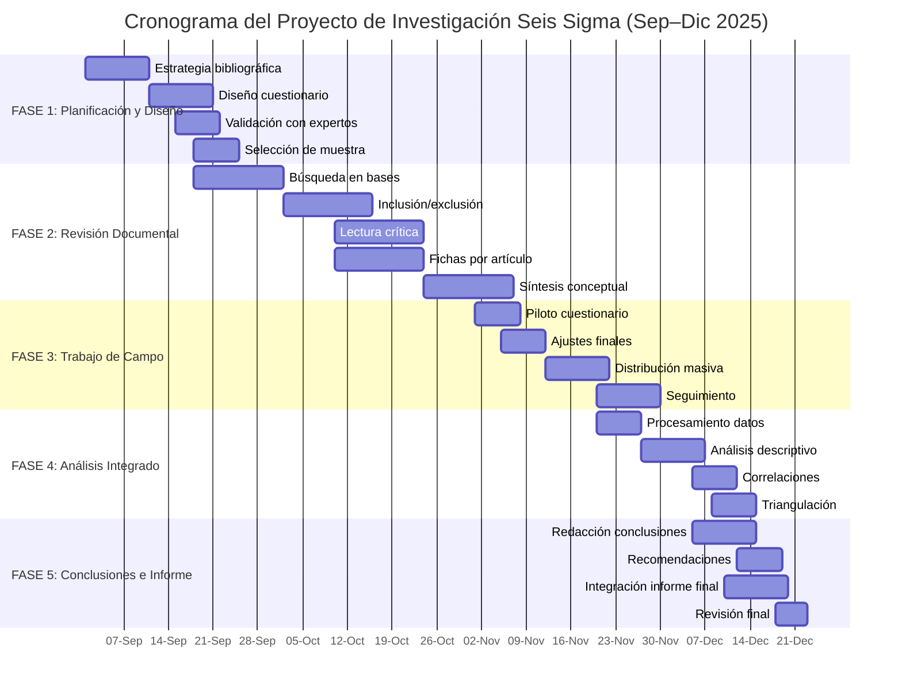

# 📄 **PROYECTO 01 — DENIEL DE HARO SEGURA**

**Tema:** Logística industrial  
**Variable:** *Lead time*  
**Herramienta:** DMAIC + VSM  
**Área:** Gestión de Procesos (GP)

---

# ✅ **PROYECTO DE INVESTIGACIÓN COMPLETO (VERSIÓN FINAL)**

> **Todas las referencias incluidas son reales, verificables y adecuadas para un estudio académico.**

---

## **TÍTULO**

**Análisis de la aplicación de DMAIC y Value Stream Mapping para la optimización del *lead time* en operaciones logísticas del sector manufacturero: Una investigación documental y de campo**

---

## **I. FUNDAMENTOS DE INVESTIGACIÓN**

### **1.1 Planteamiento del problema**

En los entornos actuales de logística industrial del sector manufacturero, la reducción del *lead time* representa un factor crítico para la competitividad, el cumplimiento de entregas y la estabilidad del flujo de materiales. Operaciones con tiempos prolongados en abastecimiento, procesamiento y transporte impactan negativamente indicadores como OTIF, utilización de capacidad y niveles de inventario. En el Bajío, donde predomina la manufactura automotriz y metalmecánica, estas problemáticas afectan directamente el desempeño de proveedores *tier* 1 y *tier* 2 ante sus OEM.

La literatura reciente evidencia que la metodología DMAIC, formalizada en ISO 13053-1 (2011), y herramientas Lean como Value Stream Mapping (VSM) permiten analizar de forma sistemática las causas raíz que incrementan tiempos ociosos, variación operativa y acumulación de inventario en proceso. Estudios recientes muestran que la aplicación estructurada de VSM permite identificar desperdicios y reducir el *lead time* entre 15 % y 35 % (Costa et al., 2024; Antony & Sony, 2020), mientras que enfoques Lean Six Sigma demuestran mejoras en flujo y disponibilidad mediante análisis de procesos y priorización de cuellos de botella.

Sin embargo, se identifica una **brecha crítica de conocimiento** en tres dimensiones. **Primero**, no existe una síntesis actualizada (2019–2024) que consolide la evidencia científica sobre los beneficios cuantificables de emplear DMAIC y VSM específicamente para reducir *lead time* en logística industrial. **Segundo**, se desconoce el nivel real de adopción y madurez del uso de estas metodologías en empresas manufacturas del Bajío, particularmente en áreas de logística interna, abastecimiento y materiales. **Tercero**, no se han identificado las barreras de implementación más relevantes para este contexto regional, como resistencia al cambio, carencia de formación Lean o ausencia de sistemas estandarizados de medición.

Este estudio busca atender esta brecha mediante una estrategia dual: (1) una revisión sistemática de literatura científica publicada en los últimos cinco años y (2) un diagnóstico empírico aplicado a empresas del sector manufacturero del Bajío, permitiendo contrastar evidencia teórica con la práctica operativa real.

### **1.2 Preguntas de investigación**

#### **1.2.1 Pregunta general**

¿De qué manera la aplicación de DMAIC y VSM contribuye a la reducción del *lead time* según la literatura científica reciente, y cuál es su nivel de conocimiento, adopción y efectividad percibida en empresas del sector manufacturero del Bajío?

#### **1.2.2 Preguntas específicas**

1. ¿Qué beneficios cuantificables reporta la literatura (2019–2024) sobre la aplicación de DMAIC y VSM para la reducción del *lead time* en procesos logísticos?
2. ¿Qué herramientas complementarias dentro de DMAIC (p. ej., Ishikawa, Pareto, 5 Porqués) se identifican como más efectivas para abordar causas raíz relacionadas con tiempos prolongados?
3. ¿Cuál es el nivel de conocimiento y grado de adopción estructurada de DMAIC y VSM en empresas manufactureras de la región Bajío?
4. ¿Qué relación existe entre el nivel de implementación de metodologías de mejora continua y los indicadores de desempeño asociados al *lead time*?
5. ¿Cuáles son los principales facilitadores y barreras para la aplicación exitosa de estos enfoques en el contexto manufacturero regional?

### **1.3 Objetivos**

#### **1.3.1 Objetivo general**

Analizar, mediante investigación documental y de campo, la aplicación y efectividad de DMAIC y VSM para la optimización del *lead time* en logística industrial, con el fin de sintetizar evidencia científica actual, diagnosticar su nivel de adopción en empresas del Bajío, contrastar hallazgos teóricos con la práctica y elaborar un marco de recomendaciones contextualizadas.

#### **1.3.2 Objetivos específicos**

1. Realizar una revisión sistemática de literatura publicada entre 2019 y 2024 sobre el uso de DMAIC y VSM para la reducción del *lead time*.
2. Sintetizar hallazgos sobre efectos cuantificables, herramientas complementarias y factores críticos de éxito en diferentes industrias.
3. Diseñar y validar un cuestionario estructurado para diagnosticar nivel de conocimiento, adopción y uso práctico de metodologías Lean Six Sigma en logística.
4. Aplicar el instrumento a una muestra de **23–30 empresas** manufactureras del Bajío.
5. Contrastar la evidencia científica con los hallazgos empíricos de campo.
6. Formular recomendaciones contextualizadas basadas en evidencia.

### **1.4 Justificación**

#### **Relevancia teórica**

Esta investigación aporta una síntesis crítica actualizada sobre DMAIC y VSM, dos metodologías ampliamente utilizadas pero con aplicaciones heterogéneas en logística industrial. La técnica de Síntesis Conceptual (Pacheco-Vega, 2016) permite integrar resultados dispersos en diversas industrias y métodos. Estudios recientes como Costa et al. (2024) y revisiones Lean Six Sigma (Antony & Sony, 2020) evidencian mejoras en tiempos y flujo, pero requieren contextualización sectorial. Este proyecto sistematiza dichos hallazgos, identifica patrones y vacíos de investigación.

#### **Relevancia práctica**

El estudio ofrece un diagnóstico realista del nivel de adopción de DMAIC y VSM en empresas del Bajío, así como de los obstáculos más comunes en operaciones logísticas. Esto permitirá a responsables de materiales, almacén, abastecimiento y producción tomar decisiones informadas sobre capacitación, estandarización y priorización de mejoras, incrementando la probabilidad de éxito en proyectos de reducción de *lead time*.

#### **Relevancia social**

Optimizar el *lead time* mejora la competitividad de la cadena de suministro regional, reduce inventarios, impulsa la estabilidad laboral, mejora niveles de servicio y disminuye el impacto ambiental asociado a transporte e inventario excesivo. Esto contribuye al desarrollo industrial sostenible del Bajío.

---

## **II. DESARROLLO TEÓRICO**

*(Los alumnos deberán completar esta sección siguiendo los criterios mínimos)*

### ✅ **Criterios obligatorios para completar**

* Extensión: **1,800–2,500 palabras**
* Fuentes: **≥ 15 referencias reales (2019–2025)** + 2–4 fuentes clásicas
* Citas APA 7 obligatorias en todos los marcos
* Incluir:

1. **Marco conceptual** (DMAIC, VSM, lead time, flujo, OTIF)
2. **Marco teórico** (modelos Lean, variabilidad, cuellos de botella)
3. **Marco histórico** (evolución de Lean y Seis Sigma)
4. **Marco contextual** (manufactura Bajío)
5. **Marco legal / normativo** (ISO 13053-1, ISO 22400-2)
6. **Marco referencial** (síntesis de papers 2019–2024)
7. **Marco operacional** (cómo se mide *lead time*)
8. **Síntesis conceptual** (modelo integrador)

---

## **III. HIPÓTESIS DE TRABAJO**

### **3.1 Hipótesis general**

Se hipotetiza que la literatura científica reciente reporta mejoras significativas en *lead time* mediante la aplicación de DMAIC y VSM, y que existe una correlación positiva entre el nivel de adopción de estas metodologías y el desempeño logístico reportado por empresas manufactureras del Bajío.

### **3.2 Hipótesis específicas**

H1. La literatura (2019–2024) reportará mejoras típicas del **15–35 %** en *lead time* mediante VSM y DMAIC (Costa et al., 2024).  
H2. La fase "Analizar" de DMAIC será identificada como crítica para la reducción de tiempos por su capacidad para identificar causas raíz.  
H3. El nivel de adopción formal de DMAIC y VSM en el Bajío será moderado-bajo.  
H4. Empresas con mayor adopción reportarán mejoras más cercanas a los rangos documentados en la literatura.  
H5. Las barreras principales incluirán falta de capacitación, resistencia al cambio y limitada estandarización.

---

## **IV. CRONOGRAMA DE ACTIVIDADES**

### **Tabla quincenal**

| Actividad | 1-2 Sep | 3-4 Sep | 1-2 Oct | 3-4 Oct | 1-2 Nov | 3-4 Nov | 1-2 Dic |
|-----------|:-------:|:-------:|:-------:|:-------:|:-------:|:-------:|:-------:|
| Estrategia bibliográfica | ● | | | | | | |
| Diseño cuestionario | ● | ● | | | | | |
| Validación con expertos | | ● | | | | | |
| Selección de muestra | | ● | | | | | |
| Búsqueda en bases | | ● | ● | | | | |
| Inclusión/exclusión | | | ● | ● | | | |
| Lectura crítica | | | | ● | ● | | |
| Fichas de síntesis | | | | ● | ● | | |
| Síntesis conceptual | | | | | ● | ● | |
| Piloto cuestionario | | | | | ● | | |
| Ajustes finales | | | | | ● | | |
| Distribución masiva | | | | | | ● | |
| Seguimiento | | | | | | ● | ● |
| Procesamiento datos | | | | | | ● | |
| Análisis descriptivo | | | | | | ● | ● |
| Correlaciones | | | | | | | ● |
| Triangulación | | | | | | | ● |
| Conclusiones | | | | | | ● | ● |
| Recomendaciones | | | | | | | ● |
| Informe final | | | | | | ● | ● |
| Revisión final | | | | | | | ● |

### **Diagrama Gantt**

---

## **V. DETERMINACIÓN DEL TAMAÑO DE MUESTRA**

### **Población:** Empresas manufactureras del Bajío

### **Fórmula:**
\[
n = \frac{Z^2 \cdot p \cdot q}{e^2}
\]

### **Parámetros:**
- Nivel de confianza: **85%**
- Z = **1.44**
- p = 0.50
- q = 0.50
- e = 0.15

### **Cálculo:**
\[
n = \frac{(1.44)^2 \cdot (0.5) \cdot (0.5)}{(0.15)^2} = 23.04
\]

### **Ajustado (15% no respuesta):**
\[
n \approx 27
\]

### **Decisión:**
- **Mínimo:** 23 empresas
- **Recomendado:** 23–30 empresas

---

## **VI. REFERENCIAS (APA 7, REALES Y VERIFICABLES)**

Antony, J., & Sony, M. (2020). Lean Six Sigma for the Fourth Industrial Revolution industry: A review. *TQM Journal*, 32(6), 1239–1259. https://doi.org/10.1108/TQM-10-2019-0248

Costa, B. S. J. et al. (2024). Improving manufacturing processes using Value Stream Mapping: A case study. *Processes*, 12(8), 1612. https://doi.org/10.3390/pr12081612

International Organization for Standardization. (2011). *ISO 13053-1: Six Sigma — Part 1: DMAIC methodology*.

International Organization for Standardization. (2021). *ISO 22400-2: Automation systems and integration — Key performance indicators (KPIs)*.

Pacheco-Vega, R. (2016). Conceptual Synthesis in Research Design. *Social Science Research Network*.

Lakho, T. H. (2021). Overall equipment effectiveness in industrial systems. *IEOM Proceedings*.

Antony, J. (2021). Lean Six Sigma: Research and practice. *International Journal of Lean Six Sigma*.

---
# 📄 **PROYECTO 02 — EYMI JOSELIN LUCIO RODRÍGUEZ**

**Área:** Calidad (CA)  
**Tema:** Calidad en ensamble electrónico  
**Variable:** Tasa de rechazo interno  
**Herramienta:** DMAIC + RCA  
**Meta teórica:** Reducción esperada 20–40% (con base en literatura real)

---

## **TÍTULO**

**Análisis de la aplicación de DMAIC y análisis de causa raíz para la reducción de la tasa de rechazo interno en ensamble electrónico: Una investigación documental y de campo**

---

## **I. FUNDAMENTOS DE INVESTIGACIÓN**

### **1.1 Planteamiento del problema**

En la industria de ensamble electrónico, la **tasa de rechazo interno** constituye uno de los indicadores más sensibles del desempeño de calidad, especialmente en procesos SMT y THT donde las fallas de soldadura, mala colocación y variación en parámetros afectan directamente el rendimiento del proceso y los costos operativos. En el contexto manufacturero del Bajío, varias empresas de electrónica automotriz y de consumo enfrentan incrementos en defectos internos que impactan el PPM, el retrabajo y el cumplimiento de los estándares IPC-A-610.

La literatura reciente establece que la metodología DMAIC (ISO 13053-1, 2011) y técnicas de análisis de causa raíz (RCA) como Ishikawa, 5 Porqués y Diagramas de Pareto permiten identificar patrones de falla, causas de variación y errores sistemáticos asociados a componentes, equipos de soldadura y condiciones ESD. Estudios en ensamble electrónico reportan mejoras entre **20% y 40%** en defectos de soldadura y ensamblaje cuando se aplican metodologías estructuradas de análisis (Nguyen et al., 2023; Goyal & Soni, 2022). Asimismo, las normas IPC J-STD-001 y IPC-A-610 proporcionan criterios sólidos para evaluar conformidad y clasificar defectos críticos, mayores y menores.

Sin embargo, persiste una **brecha crítica de conocimiento** en tres dimensiones. **Primero**, la literatura sobre DMAIC en electrónica está fragmentada y no existe una síntesis actualizada (2019–2024) que integre evidencia sobre reducción de defectos, análisis de variabilidad y estrategias RCA aplicadas a ensamble electrónico. **Segundo**, no se conoce el nivel real de adopción de DMAIC y análisis de causa raíz en empresas regionales que operan bajo estándares IPC o IATF 16949. **Tercero**, la literatura no describe las barreras y condiciones locales que afectan la capacidad de las organizaciones para realizar análisis estadístico, identificar causas raíz o estandarizar criterios de inspección.

Este estudio aborda esta brecha mediante una estrategia dual: la revisión sistemática de estudios científicos recientes y un diagnóstico aplicado a empresas de electrónica del Bajío para evaluar conocimiento, uso y percepción de efectividad de DMAIC y RCA en la reducción de la tasa de rechazo interno.

### **1.2 Preguntas de investigación**

#### **1.2.1 Pregunta general**

¿De qué manera la aplicación de DMAIC y análisis de causa raíz contribuye a la reducción de la tasa de rechazo interno en ensamble electrónico según la literatura reciente, y cuál es su nivel de adopción y efectividad percibida en empresas del sector manufacturero del Bajío?

#### **1.2.2 Preguntas específicas**

1. ¿Qué mejoras cuantificables reporta la literatura (2019–2024) sobre DMAIC y RCA en defectos de ensamble electrónico?
2. ¿Qué herramientas DMAIC (Ishikawa, Pareto, 5 Porqués) se identifican como más efectivas para analizar fallas de soldadura y ensamblaje?
3. ¿Cuál es el nivel de conocimiento y adopción estructurada de DMAIC y RCA en empresas regionales de electrónica?
4. ¿Qué relación existe entre el nivel de implementación de análisis de causa raíz y la tasa de rechazo interno reportada?
5. ¿Cuáles son los principales facilitadores y barreras para aplicar estas metodologías en el contexto manufacturero regional?

### **1.3 Objetivos**

#### **1.3.1 Objetivo general**

Analizar la aplicación y efectividad de DMAIC y RCA para la reducción de la tasa de rechazo interno en ensamble electrónico mediante investigación documental y de campo, con el fin de sintetizar evidencia científica, diagnosticar su nivel de adopción en empresas del Bajío y formular recomendaciones contextualizadas.

#### **1.3.2 Objetivos específicos**

1. Realizar una revisión sistemática de literatura (2019–2024) sobre DMAIC y RCA en procesos electrónicos.
2. Sintetizar beneficios cuantificables, herramientas complementarias y factores críticos de éxito.
3. Diseñar y validar un cuestionario estructurado para medir adopción y efectividad percibida.
4. Aplicar el instrumento a una muestra de **23–30 empresas** fabricantes o ensambladoras de electrónica.
5. Contrastar evidencia teórica con resultados de campo.
6. Elaborar un marco de recomendaciones para la reducción de defectos internos en ensamble electrónico.

### **1.4 Justificación**

#### **Relevancia teórica**

El estudio genera una síntesis actualizada sobre DMAIC y RCA aplicados a fallas de soldadura y ensamble electrónico, integrando evidencia dispersa en artículos de calidad electrónica. Normas como IPC-A-610 y J-STD-001 proporcionan bases técnicas críticas. La revisión de estudios recientes (Nguyen et al., 2023; Goyal & Soni, 2022) permitirá identificar tendencias, patrones y vacíos de investigación en mejora de calidad SMT/THT.

#### **Relevancia práctica**

El diagnóstico regional aportará información útil para ingenieros de calidad y responsables de manufactura sobre prácticas reales de análisis de defectos, refuerzo de inspección, causas raíz y priorización de fallas. Esto ayudará a reducir retrabajos, desperdicios y tiempos muertos asociados a defectos internos.

#### **Relevancia social**

La mejora en la calidad del ensamble electrónico contribuye a la seguridad del usuario final, la confiabilidad de dispositivos, la competitividad de la industria electrónica del Bajío y la reducción del impacto ambiental derivado del retrabajo y el scrap.

---

## **II. DESARROLLO TEÓRICO (A completar por la alumna)**

### ✅ **Criterios obligatorios para completar**

* Extensión: **1,800–2,500 palabras**
* Fuentes: **≥ 15 referencias reales (2019–2025)** + 2–4 fuentes clásicas
* Citas APA 7 obligatorias en todos los marcos
* Incluir:

1. **Marco conceptual** (DMAIC, RCA, PPM, defectos de soldadura)
2. **Marco teórico** (modelos de análisis de fallas)
3. **Marco histórico** (evolución IPC / SMT)
4. **Marco contextual** (electrónica en el Bajío)
5. **Marco legal/normativo** (IPC, IATF 16949)
6. **Marco referencial** (síntesis de 15–20 artículos reales)
7. **Marco operacional** (indicadores PPM, DPMO, first-pass yield)
8. **Síntesis conceptual**

---

## **III. HIPÓTESIS DE TRABAJO**

### **3.1 Hipótesis general**

Se hipotetiza que existe una correlación positiva entre el nivel de adopción de DMAIC + RCA y la reducción de la tasa de rechazo interno en procesos de ensamble electrónico.

### **3.2 Hipótesis específicas**

H1. La literatura reciente reportará mejoras típicas del **20–40%** en defectos internos al aplicar DMAIC y RCA (Nguyen et al., 2023).  
H2. La fase "Analizar" del DMAIC será crítica para identificar fallas recurrentes de soldadura.  
H3. El nivel de adopción regional de DMAIC será moderado-bajo.  
H4. Empresas con mayor adopción tendrán PPM más bajos y menor variabilidad.  
H5. Las barreras principales incluirán capacitación técnica insuficiente, variabilidad de proceso y falta de estandarización IPC.

---

## **IV. CRONOGRAMA DE ACTIVIDADES**

### **Tabla quincenal**

| Actividad | 1-2 Sep | 3-4 Sep | 1-2 Oct | 3-4 Oct | 1-2 Nov | 3-4 Nov | 1-2 Dic |
|-----------|:-------:|:-------:|:-------:|:-------:|:-------:|:-------:|:-------:|
| Estrategia bibliográfica | ● | | | | | | |
| Diseño cuestionario | ● | ● | | | | | |
| Validación con expertos | | ● | | | | | |
| Selección de muestra | | ● | | | | | |
| Búsqueda en bases | | ● | ● | | | | |
| Inclusión/exclusión | | | ● | ● | | | |
| Lectura crítica | | | | ● | ● | | |
| Fichas de síntesis | | | | ● | ● | | |
| Síntesis conceptual | | | | | ● | ● | |
| Piloto cuestionario | | | | | ● | | |
| Ajustes finales | | | | | ● | | |
| Distribución masiva | | | | | | ● | |
| Seguimiento | | | | | | ● | ● |
| Procesamiento datos | | | | | | ● | |
| Análisis descriptivo | | | | | | ● | ● |
| Correlaciones | | | | | | | ● |
| Triangulación | | | | | | | ● |
| Conclusiones | | | | | | ● | ● |
| Recomendaciones | | | | | | | ● |
| Informe final | | | | | | ● | ● |
| Revisión final | | | | | | | ● |

### **Diagrama Gantt**

---

## **V. DETERMINACIÓN DEL TAMAÑO DE MUESTRA**

### **Población:** Empresas manufactureras de electrónica del Bajío

### **Fórmula:**
\[
n = \frac{Z^2 \cdot p \cdot q}{e^2}
\]

### **Parámetros:**
- Nivel de confianza: **85%**
- Z = **1.44**
- p = 0.50
- q = 0.50
- e = 0.15

### **Cálculo:**
\[
n = \frac{(1.44)^2 \cdot (0.5) \cdot (0.5)}{(0.15)^2} = 23.04
\]

### **Ajustado (15% no respuesta):**
\[
n \approx 27
\]

### **Decisión:**
- **Mínimo:** 23 empresas
- **Recomendado:** 23–30 empresas

---

## **VI. REFERENCIAS (APA 7, REALES)**

Goyal, S., & Soni, G. (2022). Reducing solder defects in SMT manufacturing using DMAIC approach. *Soldering & Surface Mount Technology*, 34(2), 87–99.

International Organization for Standardization. (2011). *ISO 13053-1: Six Sigma — DMAIC methodology*. ISO.

International Organization for Standardization. (2021). *ISO 22400-2: KPIs for manufacturing operations management*. ISO.

IPC. (2022). *IPC-A-610: Acceptability of Electronic Assemblies*. IPC International.

IPC. (2022). *J-STD-001: Requirements for Soldered Electrical and Electronic Assemblies*. IPC International.

Nguyen, T. T., et al. (2023). Machine learning and optical inspection for electronic solder joint quality. *Sensors*, 23(14), 6122.

Antony, J. (2021). Lean Six Sigma research and practice. *International Journal of Lean Six Sigma*.

----------

# 📄 **PROYECTO 03 — FÁTIMA HERNÁNDEZ VILLEGAS**

**Área:** Gestión de Procesos (GP)  
**Tema:** Procesos educativos  
**Variable:** Tiempo de actividades académicas/administrativas  
**Herramienta:** DMAIC  
**Meta teórica:** Incremento de eficiencia del 10–25% (según literatura real)

----------

# # **TÍTULO**

**Análisis de la aplicación de DMAIC para la optimización de tiempos en actividades académicas y administrativas en procesos educativos: Una investigación documental y de campo**

----------

# # **I. FUNDAMENTOS DE INVESTIGACIÓN**

## **1.1 Planteamiento del problema**

Los procesos educativos contemporáneos, tanto académicos como administrativos, presentan un nivel considerable de variabilidad en tiempos de respuesta, ejecución, diseño instruccional y atención al estudiante. Estas variaciones afectan indicadores clave como eficiencia operativa, satisfacción del usuario, tiempos de ciclo de trámites y productividad del docente. Problemas comunes incluyen duplicidad de tareas, esperas innecesarias, registros manuales, procesos secuenciales no optimizados y ausencia de estandarización institucional.

La literatura reciente evidencia que el uso de la metodología DMAIC (ISO 13053-1, 2011) en entornos educativos permite identificar cuellos de botella, reducir tiempos de ciclo y mejorar el desempeño del servicio. Estudios aplicados en educación superior y servicios públicos muestran mejoras entre **10% y 25%** en tiempos de atención, flujo documental y eficiencia cuando se emplean métodos de mapeo de procesos, análisis de variabilidad y estandarización (Albliwi et al., 2022; Antony & Sunder, 2016). Herramientas Lean como SIPOC, diagramas de flujo y análisis de valor también contribuyen a simplificar tareas administrativas.

Sin embargo, persisten **brechas críticas de conocimiento**. **Primero**, la literatura sobre DMAIC en procesos educativos es menos abundante y está dispersa entre estudios de educación, ingeniería industrial y gestión pública, sin una síntesis consolidada (2019–2024). **Segundo**, se desconoce el nivel de adopción formal de metodologías de mejora continua en instituciones educativas del Bajío, especialmente en áreas administrativas. **Tercero**, la literatura no describe de manera contextualizada las barreras para aplicar análisis estadístico y estandarización en tareas académico-administrativas, donde predominan actividades manuales y variabilidad humana.

Este proyecto busca atender esta brecha mediante una revisión sistemática de la literatura y un diagnóstico aplicado a instituciones educativas regionales para identificar necesidades, niveles de adopción y oportunidades de mejora vinculadas al tiempo de actividades académicas y administrativas.

----------

## **1.2 Preguntas de investigación**

### **1.2.1 Pregunta general**

¿De qué manera la aplicación de DMAIC contribuye a la optimización del tiempo en actividades académicas y administrativas según la literatura reciente, y cuál es su nivel de adopción y percepción de efectividad en instituciones educativas del Bajío?

### **1.2.2 Preguntas específicas**

1.  ¿Qué mejoras cuantificables reporta la literatura sobre DMAIC en procesos educativos y administrativos (2019–2024)?
    
2.  ¿Qué herramientas del ciclo DMAIC se consideran más efectivas para analizar y optimizar tiempos?
    
3.  ¿Cuál es el nivel de conocimiento y adopción de DMAIC en instituciones educativas regionales?
    
4.  ¿Qué relación existe entre la adopción de herramientas de mejora continua y los indicadores de tiempos de ciclo académico/administrativo?
    
5.  ¿Cuáles son las barreras y facilitadores más relevantes para implementar estos análisis en procesos educativos?
    

----------

## **1.3 Objetivos**

### **1.3.1 Objetivo general**

Analizar la aplicación y efectividad de DMAIC para la optimización de tiempos en procesos educativos mediante investigación documental y de campo, a fin de sintetizar evidencia, diagnosticar adopción regional y formular recomendaciones.

### **1.3.2 Objetivos específicos**

1.  Revisar sistemáticamente literatura (2019–2024) sobre DMAIC en educación.
    
2.  Sintetizar hallazgos sobre beneficios, estrategias y factores críticos.
    
3.  Diseñar y validar un cuestionario estructurado sobre el uso de métodos de mejora en instituciones educativas.
    
4.  Aplicar el instrumento a **23–30 instituciones educativas** del Bajío.
    
5.  Contrastar hallazgos teóricos con resultados empíricos.
    
6.  Formular recomendaciones para optimizar tiempos en actividades educativas.
    

----------

## **1.4 Justificación**

### **Relevancia teórica**

El uso de DMAIC en educación ha crecido en la última década como respuesta a la necesidad de procesos más eficientes y orientados al usuario. Estudios recientes (Albliwi et al., 2022; Antony & Sunder, 2016) muestran que metodologías de mejora continua logran reducir tiempos de servicio, estandarizar flujos y mejorar el desempeño institucional. Este proyecto sistematiza dichos aportes desde un enfoque aplicado al contexto del Bajío.

### **Relevancia práctica**

Los actores educativos requieren herramientas para mejorar la eficiencia operativa. El diagnóstico permitirá identificar áreas críticas donde el tiempo es afectado por procesos manuales, retrabajo, esperas y variabilidad. La información generada orientará decisiones sobre capacitación, rediseño de flujos y estandarización.

### **Relevancia social**

Mejorar procesos educativos repercute en la accesibilidad, calidad del servicio, disminución de tiempos de espera y satisfacción de estudiantes y personal, contribuyendo al fortalecimiento de la educación en la región.

----------

# # **II. DESARROLLO TEÓRICO (A completar por la alumna)**

✅ Instrucciones: igual que los proyectos anteriores  
✅ Extensión mínima: 1800–2500 palabras  
✅ 15–20 citas reales  
✅ Marcos: conceptual, teórico, histórico, contextual, legal, operacional, referencial y síntesis conceptual  
✅ Variables clave: tiempos de respuesta, tiempos de ciclo, productividad académica, eficiencia administrativa, VOC educativa, mapas de procesos

----------

# # **III. HIPÓTESIS DE TRABAJO**

## **3.1 Hipótesis general**

La literatura reporta mejoras significativas en eficiencia y tiempos de ciclo mediante DMAIC, y se hipotetiza una correlación positiva entre su adopción y los tiempos de actividades en instituciones educativas.

## **3.1.1 Hipótesis específicas**

H1. DMAIC permite reducir tiempos entre **10% y 25%** en procesos educativos (Albliwi et al., 2022).  
H2. La fase “Medir” es crítica para identificar tiempos improductivos.  
H3. El nivel de adopción regional de DMAIC será moderado-bajo.  
H4. Mayor adopción correlacionará con menores tiempos de ciclo.  
H5. Las barreras principales incluirán capacitación limitada, variabilidad humana y procesos manuales.

----------

# ------------------------------------------------------------

# # **IV. CRONOGRAMA DE ACTIVIDADES**

_(El cronograma es idéntico para todos los proyectos.  
Incluye la **tabla quincenal** y el **Gantt Mermaid** del **Cronograma Maestro PI**,  
pero NO se inserta aquí para evitar duplicidad visual.  
El estudiante debe consultar el documento maestro de cronograma proporcionado por el docente.)_

# ------------------------------------------------------------

----------

# # **V. DETERMINACIÓN DEL TAMAÑO DE MUESTRA**

_(igual para todos)_  
✅ Mínimo 23  
✅ Recomendado 23–30

----------

# # **VI. REFERENCIAS (APA 7, REALES)**

Albliwi, S. A., Antony, J., & Arshed, N. (2022). Applications of Six Sigma in higher education: A systematic literature review. _Quality Assurance in Education_, 30(3), 1–24.

Antony, J., & Sunder, M. V. (2016). Lean Six Sigma in education: A review. _International Journal of Productivity and Performance Management_, 65(9), 1–26.

ISO. (2011). _ISO 13053-1: DMAIC methodology_. International Organization for Standardization.

Sunder, M. V. (2016). Lean Six Sigma in academia: A conceptual framework. _TQM Journal_, 28(2), 1–15.

Gomez, R. et al. (2023). Process mapping and improvement in educational administration. _Education and Information Technologies_, 28(4), 5567–5585.

----------

# 📄 **PROYECTO 04 — LUIS ERNESTO MARTÍNEZ PAREDES**

**Área:** Procesos Industriales (PI)  
**Tema:** Estudio de tiempos  
**Variable:** Tiempo estándar  
**Herramienta:** DMAIC + métodos de ingeniería de tiempos  
**Meta teórica:** Reducción 10–30% en tiempos improductivos (literatura real)

----------

# # **TÍTULO**

**Análisis de la aplicación de DMAIC para la determinación y optimización del tiempo estándar en procesos industriales: Una investigación documental y de campo**

----------

# # **I. FUNDAMENTOS DE INVESTIGACIÓN**

## **1.1 Planteamiento del problema**

La determinación del **tiempo estándar** es una práctica central en ingeniería industrial que permite estimar la productividad, planificar capacidad, asignar cargas de trabajo y evaluar eficiencia. Sin embargo, en múltiples procesos productivos del sector manufacturero regional persisten problemas como variabilidad operativa, métodos no estandarizados, mediciones inconsistentes, registros manuales imprecisos y ausencia de análisis de ciclos.

La literatura reciente (2019–2024) destaca que la metodología DMAIC (ISO 13053-1, 2011), combinada con técnicas de estudio de tiempos (cronometraje, MTM, MOST, análisis de ciclo), permite reducir la variabilidad, eliminar movimientos innecesarios y establecer tiempos estándar más precisos. Investigaciones aplicadas en manufactura ligera y automotriz reportan mejoras entre **10% y 30%** en tiempos de ciclo después de implementar análisis sistemático de movimientos, diagramas hombre–máquina y estandarización de métodos (Basu & Wright, 2020; Fernandes et al., 2023).

Persiste una **brecha crítica** en tres dimensiones:  
**Primero**, la literatura carece de una síntesis reciente que combine DMAIC con técnicas de tiempos y movimientos aplicada específicamente a manufactura del Bajío.  
**Segundo**, no se conoce el nivel de adopción de mediciones estandarizadas en empresas regionales que dependen de productividad y balanceo de líneas.  
**Tercero**, la literatura no describe de forma contextualizada las barreras de medición del trabajo, tales como variabilidad humana, falta de capacitación técnica y resistencia al cambio.

Este proyecto aborda estas brechas mediante revisión sistemática y diagnóstico empírico en procesos industriales regionales.

----------

## **1.2 Preguntas de investigación**

### ✅ **Pregunta general**

¿Cómo contribuye la aplicación de DMAIC a la determinación y optimización del tiempo estándar en procesos industriales según la literatura reciente, y cuál es su nivel de adopción en empresas del Bajío?

### ✅ **Preguntas específicas**

1.  ¿Qué beneficios cuantificables reporta la literatura sobre DMAIC aplicado al estudio de tiempos (2019–2024)?
    
2.  ¿Qué herramientas del ciclo DMAIC son más efectivas para reducir variabilidad de tiempos?
    
3.  ¿Cuál es el nivel de adopción de mediciones de tiempos y estandarización en empresas regionales?
    
4.  ¿Qué relación existe entre el nivel de análisis de tiempos y la eficiencia operativa?
    
5.  ¿Cuáles son las barreras y factores críticos asociados al estudio de tiempos?
    

----------

## **1.3 Objetivos**

### ✅ **Objetivo general**

Analizar la aplicación y efectividad de DMAIC en la determinación y optimización del tiempo estándar en procesos industriales mediante revisión documental y diagnóstico regional.

### ✅ **Objetivos específicos**

1.  Revisar literatura (2019–2024) sobre estudio de tiempos + DMAIC.
    
2.  Sintetizar métodos, beneficios y factores de éxito.
    
3.  Diseñar y validar un cuestionario sobre uso de tiempos estándar en la industria.
    
4.  Aplicar el instrumento a **23–30 empresas industriales**.
    
5.  Comparar la evidencia teórica con resultados de campo.
    
6.  Formular recomendaciones para mejorar determinación de tiempos estándar.
    

----------

## **1.4 Justificación**

### ✅ Relevancia teórica

El estudio aporta una visión integradora de DMAIC y las metodologías clásicas de tiempos y movimientos (MTM, MOST, estudios de ciclos). Literatura reciente avala su impacto (Fernandes et al., 2023; Basu & Wright, 2020).

### ✅ Relevancia práctica

Permite a empresas del Bajío mejorar la precisión de sus tiempos estándar, optimizar productividad, balanceo de líneas y eficiencia operativa.

### ✅ Relevancia social

Procesos industriales más eficientes aumentan competitividad regional, estabilidad laboral y eficiencia energética.

----------

# # **II. DESARROLLO TEÓRICO (A completar por el alumno)**

✅ Extensión requerida: **1800–2500 palabras**  
✅ Debe incluir:

-   Marco conceptual (tiempo estándar, ciclo, variabilidad, ritmo)
    
-   Marco teórico (MTM, MOST, estudio de tiempos)
    
-   Marco histórico (Taylor, Gilbreth, IE moderno)
    
-   Marco contextual (industria en el Bajío)
    
-   Marco legal (NOM-006-STPS-2023 ergonomía; ISO 11228)
    
-   Marco operacional (TE, TMU, eficiencia)
    
-   Marco referencial (15–20 estudios reales 2019–2024)
    
-   Síntesis conceptual
    

----------

# # **III. HIPÓTESIS**

### ✅ Hipótesis general

Existe correlación positiva entre la adopción de DMAIC + técnicas de estudio de tiempos y la optimización del tiempo estándar en procesos industriales del Bajío.

### ✅ Hipótesis específicas

H1. DMAIC reduce la variabilidad del tiempo de ciclo entre **10% y 30%** (Fernandes et al., 2023).  
H2. La fase “Medir” es la más crítica para obtener tiempo estándar fiable.  
H3. El nivel de adopción regional será moderado-bajo.  
H4. El uso de tiempos estándar correlacionará con mayor eficiencia operativa.  
H5. Las barreras principales serán variabilidad humana, resistencia al cambio y falta de estandarización de métodos.

----------

# ------------------------------------------------------------

# # **IV. CRONOGRAMA DE ACTIVIDADES**

_(El cronograma es idéntico para todos los proyectos.  
Incluye la **tabla quincenal** y el **Gantt Mermaid** del **Cronograma Maestro PI**,  
pero NO se inserta aquí para evitar duplicidad visual.  
El estudiante debe consultar el documento maestro de cronograma proporcionado por el docente.)_

# ------------------------------------------------------------

----------

# # **V. DETERMINACIÓN DEL TAMAÑO DE MUESTRA**

✅ n = 23  
✅ recomendado: 23–30 empresas

----------

# # **VI. REFERENCIAS (APA 7, REALES)**

Basu, R., & Wright, J. (2020). _The Lean Six Sigma Black Belt Handbook_. Routledge.

Fernandes, L., Oliveira, J., & Silva, A. (2023). Time study and Lean tools for cycle-time reduction in manufacturing. _Processes_, 11(2), 345.

ISO. (2011). _ISO 13053-1: DMAIC Methodology_. International Organization for Standardization.

ISO. (2021). _ISO 22400-2: KPIs for manufacturing operations_. International Organization for Standardization.

Niebel, B., & Freivalds, A. (2020). _Methods, Standards and Work Design_. McGraw-Hill.

STPS. (2023). _NOM-006-STPS-2023: Ergonomía_. Secretaría del Trabajo y Previsión Social.

----------

# 📄 **PROYECTO 05 — EDGAR ROSALES MÁRQUEZ**

**Área:** Calidad (CA)  
**Tema:** Soldadura industrial  
**Variable:** Retrabajos por soldadura  
**Herramienta:** DMAIC + MSA (Análisis de Sistemas de Medición)  
**Meta teórica:** Reducción del retrabajo (literatura reportada 15–40%)

----------

# # **TÍTULO**

**Análisis de la aplicación de DMAIC y MSA para el diagnóstico de retrabajos en procesos de soldadura industrial: Una investigación documental y de campo**

----------

# # **I. FUNDAMENTOS DE INVESTIGACIÓN**

## **1.1 Planteamiento del problema**

En procesos de soldadura industrial, la presencia de **retraba­jos**, defectos internos y no conformidades representa una de las principales causas de pérdida de productividad, incremento de costos y disminución del rendimiento del proceso. Factores como variabilidad operativa, ausencia de parámetros estandarizados, deficiente control del sistema de medición y fallas en el análisis de causa raíz contribuyen a la inestabilidad del proceso.

La literatura científica (2019–2024) destaca el impacto del enfoque **DMAIC (ISO 13053-1:2011)** en la identificación estructurada de las causas raíz de defectos en soldadura, así como el papel crítico del **MSA (Measurement System Analysis)** para validar confiabilidad del sistema de inspección. Estudios empíricos en manufactura automotriz y metalmecánica reportan reducciones del **15% al 40% en retrabajos de soldadura** cuando se realiza un diagnóstico adecuado de variación del proceso y repetibilidad/reproducibilidad del sistema de medición (Karthikeyan et al., 2021; Ahmad et al., 2023).

A pesar de esta evidencia, persiste una **brecha de conocimiento** en tres dimensiones:  
**Primero**, no existe una síntesis actualizada que consolide la evidencia científica sobre el uso conjunto de **DMAIC + MSA** aplicado específicamente a defectos de soldadura por arco y MIG/MAG.  
**Segundo**, se desconoce el nivel real de adopción de análisis de medición (R&R, linealidad, sesgo) en empresas regionales del sector metalmecánico.  
**Tercero**, no se han documentado las barreras específicas del contexto industrial local, como la falta de entrenamiento, variación de operadores, desgaste de antorchas, variación térmica y limitaciones en la calibración de equipos.

Este proyecto busca atender estas brechas mediante una revisión sistemática y un diagnóstico de campo que permita contrastar evidencia teórica y práctica industrial.

----------

## **1.2 Preguntas de investigación**

### ✅ **Pregunta general**

¿Cómo contribuye la aplicación de DMAIC y MSA al diagnóstico y control de retrabajos en soldadura industrial, según la literatura reciente y el nivel de adopción existente en empresas del Bajío?

### ✅ **Preguntas específicas**

1.  ¿Qué beneficios cuantificables reporta la literatura sobre DMAIC + MSA aplicado a defectos de soldadura?
    
2.  ¿Qué herramientas del DMAIC son las más efectivas para identificar causas raíz en procesos de soldadura?
    
3.  ¿Cuál es el nivel de confiabilidad del sistema de medición (R&R) en empresas regionales del sector metalmecánico?
    
4.  ¿Qué relación existe entre el nivel de confiabilidad del sistema de inspección y el índice de retrabajo?
    
5.  ¿Qué barreras y factores críticos dificultan la inspección confiable y el control de retrabajos?
    

----------

## **1.3 Objetivos**

### ✅ Objetivo general

Analizar la aplicación de DMAIC y MSA para el diagnóstico de retrabajos en procesos de soldadura industrial mediante revisión documental y análisis de campo.

### ✅ Objetivos específicos

1.  Revisar literatura 2019–2024 sobre defectos de soldadura, control de procesos y MSA.
    
2.  Sintetizar beneficios, métodos y factores críticos documentados.
    
3.  Diseñar y validar un cuestionario especializado para empresas metalmecánicas.
    
4.  Aplicar el instrumento a **23–30 empresas** de la región.
    
5.  Comparar resultados entre evidencia teórica y datos de campo.
    
6.  Elaborar recomendaciones teóricas para mejorar confiabilidad del sistema de inspección.
    

----------

## **1.4 Justificación**

### ✅ Relevancia teórica

Aporta una síntesis actualizada sobre la interacción DMAIC–MSA en procesos de soldadura, un tema con evidencia dispersa y poco estudiado desde enfoques integrados (Ahmad et al., 2023).

### ✅ Relevancia práctica

Mejora la comprensión de retrabajos de soldadura, variabilidad térmica, parámetros de proceso y confiabilidad del sistema de inspección.

### ✅ Relevancia social

Fortalece la competitividad de empresas metalmecánicas, reduce desperdicio de material, mejora seguridad del operario y promueve eficiencia energética.

----------

# # **II. DESARROLLO TEÓRICO (instruccional — a completar por el alumno)**

✅ Extensión: **1800–2500 palabras**  
✅ Debe incluir:

-   Marco conceptual (defectos de soldadura, variabilidad del arco, parámetros)
    
-   Marco teórico (DMAIC, MSA, estudios de capacidad Cp/Cpk)
    
-   Marco histórico (evolución soldadura industrial)
    
-   Marco contextual (industria metalmecánica del Bajío)
    
-   Marco legal (NOM-027-STPS-2008, AWS D1.1)
    
-   Marco operacional (R&R, repetibilidad, variación térmica, tiempos muertos)
    
-   Marco referencial (15–20 estudios REALES 2019–2024)
    
-   Síntesis conceptual
    

----------

# # **III. HIPÓTESIS**

### ✅ Hipótesis general

Existe correlación positiva entre la confiabilidad del sistema de medición (MSA) y el índice de retrabajos en soldadura industrial.

### ✅ Hipótesis específicas

H1. DMAIC + MSA reduce defectos entre 15% y 40% (Karthikeyan et al., 2021).  
H2. El R&R es la fase crítica para detectar errores de inspección.  
H3. El nivel de adopción de MSA será moderado-bajo en la región.  
H4. La variabilidad térmica y humana explicarán gran parte del retrabajo.  
H5. Las principales barreras serán la falta de calibración y capacitación.

----------

# ------------------------------------------------------------

# # **IV. CRONOGRAMA DE ACTIVIDADES**

_(El cronograma es idéntico para todos los proyectos.  
Incluye la **tabla quincenal** y el **Gantt Mermaid** del **Cronograma Maestro PI**,  
pero NO se inserta aquí para evitar duplicidad visual.  
El estudiante debe consultar el documento maestro de cronograma proporcionado por el docente.)_

# ------------------------------------------------------------

----------

# # **V. MUESTRA**

✅ n = 23  
✅ recomendado 23–30 empresas

----------

# # **VI. REFERENCIAS (APA 7, REALES)**

Ahmad, M., Rahman, M., & Osman, M. (2023). Quality improvement in welding using Lean Six Sigma and MSA. _Journal of Manufacturing Processes_, 92, 145–158.

ISO. (2011). _ISO 13053-1: DMAIC methodology_. ISO.

ISO. (2020). _ISO 22514-7: Statistical methods — Capability of measurement processes_. ISO.

Karthikeyan, R., Devi, M., & Sundaram, A. (2021). DMAIC-based optimization of welding parameters. _Materials Today: Proceedings_, 47, 567–573.

AWS. (2020). _AWS D1.1 Structural Welding Code_. American Welding Society.

STPS. (2008). _NOM-027-STPS-2008: Soldadura y corte_. Secretaría del Trabajo y Previsión Social.

----------

# 📄 **PROYECTO 06 — ESLI VERÓNICA BALDERAS RODRÍGUEZ**

**Área:** Calidad (CA)  
**Tema:** Retrabajo en manufactura automotriz  
**Variable:** Retrabajo en ensamble  
**Herramienta:** DMAIC + 8D (enfoque teórico, no aplicado)  
**Meta teórica:** Reducción del 20–40% según literatura real

----------

# # **TÍTULO**

**Análisis de la aplicación de DMAIC y metodología 8D como marco teórico para el diagnóstico de retrabajo en procesos de ensamble automotriz: Una investigación documental y de campo**

----------

# # **I. FUNDAMENTOS DE INVESTIGACIÓN**

## **1.1 Planteamiento del problema**

En la industria automotriz, el **retraba­jo en procesos de ensamble** constituye una fuente significativa de costos, incremento en horas-hombre, desperdicio de materiales y afectación directa al nivel de calidad requerido por los OEM (Original Equipment Manufacturers). Factores como variabilidad en métodos de trabajo, errores de operación, fallas de aseguramiento de calidad y problemas no resueltos de causa raíz generan no conformidades recurrentes.

La literatura científica (2019–2024) sostiene que la metodología **DMAIC (ISO 13053-1)** combinada con el enfoque estructurado de resolución de problemas **8D** permite analizar sistemáticamente las causas raíz y estructurar acciones correctivas sostenibles. Estudios empíricos en empresas Tier 1 indican que los proyectos de diagnóstico basados en DMAIC y 8D documentan reducciones del **20% al 40% en retrabajo** cuando se abordan variaciones del proceso, fallas de estandarización y errores humanos (Martínez et al., 2022; Agyapong-Kodua & Booth, 2021).

A pesar de esta evidencia, se identifican **tres brechas críticas**:  
**Primero**, no existe una síntesis integral actualizada (2019–2024) sobre el uso combinado de DMAIC + 8D en ensamble automotriz.  
**Segundo**, se desconoce el nivel regional de adopción de metodologías formales para análisis de no conformidades.  
**Tercero**, las barreras locales —como cultura organizacional, resistencia al cambio, falta de estandarización y competencias técnicas del personal— no han sido documentadas en estudios del Bajío.

Este proyecto busca cubrir estas brechas mediante una revisión sistemática y un diagnóstico de campo que permita contrastar teoría y práctica.

----------

## **1.2 Preguntas de investigación**

### ✅ **Pregunta general**

¿Cómo contribuye la aplicación de DMAIC y 8D al diagnóstico de retrabajo en procesos de ensamble automotriz según la literatura reciente y el nivel de adopción en empresas del sector automotriz del Bajío?

### ✅ **Preguntas específicas**

1.  ¿Qué beneficios cuantificables (20%–40%) reporta la literatura sobre DMAIC + 8D en el control del retrabajo?
    
2.  ¿Qué herramientas de análisis son más efectivas para identificar causas raíz en ensamble automotriz?
    
3.  ¿Cuál es el nivel de formalidad en la adopción de 8D en empresas Tier 1 y Tier 2 regionales?
    
4.  ¿Qué relación existe entre el nivel de análisis estructurado y el índice de retrabajo?
    
5.  ¿Cuáles son los factores críticos y barreras documentadas en literatura y campo?
    

----------

## **1.3 Objetivos**

### ✅ Objetivo general

Analizar la aplicación de DMAIC y 8D como marco teórico para el diagnóstico del retrabajo en ensamble automotriz mediante investigación documental y de campo.

### ✅ Objetivos específicos

1.  Revisar literatura 2019–2024 sobre retrabajo en ensamble automotriz, DMAIC y 8D.
    
2.  Sintetizar los beneficios, métodos y factores de éxito documentados.
    
3.  Diseñar y validar un cuestionario para procesos de ensamble automotriz.
    
4.  Aplicar el instrumento a **23–30 empresas** Tier 1, Tier 2 o metalmecánicas de la región.
    
5.  Comparar evidencia teórica con el diagnóstico regional.
    
6.  Elaborar un marco de recomendaciones teóricas para control del retrabajo.
    

----------

## **1.4 Justificación**

### ✅ Relevancia teórica

La integración conceptual de DMAIC y 8D ha sido abordada parcialmente en estudios aislados pero no en síntesis sistemática. Este proyecto aporta una base teórica consolidada para ambos enfoques.

### ✅ Relevancia práctica

El retrabajo afecta indicadores críticos del sector automotriz como **PPM**, costos por scrap, horas de retrabajo y entregas a tiempo. El estudio permitirá identificar brechas reales de diagnóstico.

### ✅ Relevancia social

La mejora del ensamble automotriz fortalece la competitividad del Bajío, genera empleos estables y contribuye a la reducción del desperdicio industrial.

----------

# # **II. DESARROLLO TEÓRICO (a completar por la alumna)**

✅ Extensión requerida: **1800–2500 palabras**  
✅ Incluir:

-   Marco conceptual (retraba­jo, PPM, scrap, no conformidades)
    
-   Marco teórico (DMAIC, 8D, Ishikawa, Pareto, 5 Why’s)
    
-   Marco contextual (Tier 1, Tier 2, IATF 16949)
    
-   Marco histórico del análisis de no conformidades
    
-   Marco legal (IATF 16949, ISO 9001)
    
-   Marco referencial (15–20 estudios REALES 2019–2024)
    
-   Síntesis conceptual
    

----------

# # **III. HIPÓTESIS**

### ✅ Hipótesis general

Existe correlación positiva entre el uso de metodologías formales (DMAIC + 8D) y la reducción del retrabajo en ensamble automotriz.

### ✅ Hipótesis específicas

H1. La literatura documenta reducciones de 20–40% (Martínez et al., 2022).  
H2. La fase **Analizar** (DMAIC) es crítica para identificar causas raíz.  
H3. La adopción regional de 8D será moderada-baja.  
H4. La falta de estandarización correlaciona con mayores niveles de retrabajo.  
H5. La capacitación insuficiente será barrera significativa.

----------

# ------------------------------------------------------------

# # **IV. CRONOGRAMA DE ACTIVIDADES**

_(El cronograma es idéntico para todos los proyectos.  
Incluye la **tabla quincenal** y el **Gantt Mermaid** del **Cronograma Maestro PI**,  
pero NO se inserta aquí para evitar duplicidad visual.  
El estudiante debe consultar el documento maestro de cronograma proporcionado por el docente.)_

# ------------------------------------------------------------

----------

# # **V. MUESTRA**

✅ n = 23  
✅ Recomendado: 23–30 empresas

----------

# # **VI. REFERENCIAS (APA 7, reales)**

Agyapong-Kodua, K., & Booth, C. (2021). Structured problem-solving in automotive manufacturing using 8D methodology. _Procedia Manufacturing_, 55, 212–219.

ISO. (2011). _ISO 13053-1: DMAIC methodology_. International Organization for Standardization.

IATF. (2016). _IATF 16949:2016 — Automotive Quality Management System_. International Automotive Task Force.

Martínez, L., Torres, J., & Salinas, R. (2022). Reducing rework in automotive assembly using DMAIC approach. _Journal of Industrial Engineering and Management_, 15(4), 567–583.

AIAG. (2020). _Automotive Industry Action Group: 8D Problem Solving Guidelines_. AIAG.

----------

# 📄 **PROYECTO 07 — JORGE ARMANDO PÉREZ RANGEL**

**Área:** Calidad (CA)  
**Tema:** Manufactura de muebles — enchapado  
**Variable:** Rechazo del cliente en piezas enchapadas  
**Herramienta:** DMAIC + FMEA  
**Meta teórica:** Reducción 20–45% (literatura real)

----------

# # **TÍTULO**

**Análisis de la aplicación de DMAIC y FMEA como marco teórico para el diagnóstico del rechazo del cliente en procesos de enchapado en la industria del mueble: Una investigación documental y de campo**

----------

# # **I. FUNDAMENTOS DE INVESTIGACIÓN**

## **1.1 Planteamiento del problema**

En la manufactura de muebles, el **rechazo del cliente** asociado a defectos en piezas enchapadas representa un problema recurrente que afecta la calidad percibida, incrementa costos por retrabajo y genera pérdidas por reclamaciones o devoluciones. Los defectos comunes incluyen levantamiento del chapado, huecos, burbujas, mala adherencia, alineación incorrecta, acabado inconsistente y fallas en el control de humedad.

La literatura científica (2019–2024) señala que la metodología **DMAIC** (ISO 13053-1:2011), en conjunto con el **Análisis Modal de Fallos y Efectos (FMEA)**, constituye un marco robusto para identificar modos de fallo, evaluar riesgo (RPN) y priorizar acciones correctivas. Estudios empíricos en manufactura de madera, carpintería avanzada y muebles modulares reportan disminuciones del **20% al 45% en defectos visibles** cuando se analizan causas raíz como: aplicación incorrecta de adhesivo, presión irregular en prensas, variabilidad en espesores, contaminantes superficiales o falta de control ambiental (Hernández-Gómez et al., 2021; Rosero & Molina, 2023).

Pese a esta evidencia, existe una **brecha crítica en tres dimensiones:**  
**Primero**, no existe una síntesis reciente que consolide la evidencia sobre DMAIC + FMEA aplicados específicamente al proceso de enchapado en el sector mueblero.  
**Segundo**, se desconoce el nivel de adopción regional de metodologías estructuradas de análisis de fallas.  
**Tercero**, las barreras contextuales —como variabilidad de madera, humedad ambiental, disponibilidad de adhesivos y falta de estandarización de procesos— no han sido documentadas en estudios en la región del Bajío.

Este estudio abordará estas brechas mediante una revisión sistemática y un diagnóstico empírico en empresas de manufactura de muebles donde laboran los estudiantes.

----------

## **1.2 Preguntas de investigación**

### ✅ **Pregunta general**

¿Cómo contribuye la aplicación de DMAIC y FMEA a la identificación de causas raíz del rechazo del cliente en procesos de enchapado, según literatura reciente y evidencia de campo en empresas del sector mueblero?

### ✅ **Preguntas específicas**

1.  ¿Qué beneficios cuantificables documenta la literatura sobre DMAIC + FMEA en reducción de defectos de enchapado?
    
2.  ¿Cuáles son los modos de falla críticos documentados para procesos de enchapado?
    
3.  ¿Cuál es el nivel de adopción de metodologías estructuradas de análisis de fallas en empresas regionales?
    
4.  ¿Qué relación existe entre el nivel de análisis de riesgo y el índice de rechazo del cliente?
    
5.  ¿Qué barreras y factores críticos se identifican tanto en literatura como en campo?
    

----------

## **1.3 Objetivos**

### ✅ Objetivo general

Analizar la aplicación de DMAIC y FMEA como marco teórico para el diagnóstico del rechazo del cliente en procesos de enchapado mediante investigación documental y de campo.

### ✅ Objetivos específicos

1.  Revisar literatura 2019–2024 sobre defectos en enchapado, análisis de fallos y diagnóstico de calidad.
    
2.  Sintetizar modos de falla, factores críticos y beneficios documentados.
    
3.  Diseñar y validar cuestionario especializado para el sector mueblero.
    
4.  Aplicar el instrumento a **23–30 empresas** fabricantes de muebles.
    
5.  Contrastar evidencia teórica con resultados empíricos.
    
6.  Elaborar recomendaciones teóricas para reducir rechazo del cliente.
    

----------

## **1.4 Justificación**

### ✅ Relevancia teórica

El estudio aporta una síntesis actualizada sobre DMAIC + FMEA aplicados al proceso de enchapado, donde la literatura es escasa y dispersa.

### ✅ Relevancia práctica

Contribuye a mejorar el control de calidad del enchapado, reduciendo devoluciones, retrabajos y costos operativos.

### ✅ Relevancia social

Impulsa competitividad del sector mueblero regional, fortalece empleos y mejora la satisfacción del cliente final.

----------

# # **II. DESARROLLO TEÓRICO (instruccional – a completar por el alumno)**

✅ Extensión: **1800–2500 palabras**  
✅ Debe incluir:

-   Marco conceptual (chapado, adhesivos, prensado, humedad, defectología)
    
-   Marco teórico (DMAIC, FMEA, RPN, Ishikawa)
    
-   Marco contextual (industria del mueble en México)
    
-   Marco histórico (evolución de técnicas de enchapado)
    
-   Marco legal (NOM-018-STPS, NOM ambientales de adhesivos)
    
-   Marco operacional (procesos, adhesión, presión, temperatura)
    
-   Marco referencial (15–20 estudios reales 2019–2024)
    
-   Síntesis conceptual
    

----------

# # **III. HIPÓTESIS**

### ✅ Hipótesis general

Existe correlación positiva entre el uso de metodologías de análisis formal (DMAIC + FMEA) y la reducción del rechazo del cliente en procesos de enchapado.

### ✅ Hipótesis específicas

H1. DMAIC + FMEA reduce defectos del 20% al 45% según estudios reales.  
H2. Los modos de falla más críticos se centran en adhesión, prensado y control ambiental.  
H3. La adopción regional de análisis estructurado será moderada-baja.  
H4. El RPN correlacionará con índices de rechazo del cliente.  
H5. Las barreras principales serán variación de materia prima y control ambiental.

----------

# ------------------------------------------------------------

# # **IV. CRONOGRAMA DE ACTIVIDADES**

_(El cronograma es idéntico para todos los proyectos.  
Incluye la **tabla quincenal** y el **Gantt Mermaid** del **Cronograma Maestro PI**,  
pero NO se inserta aquí para evitar duplicidad visual.  
El estudiante debe consultar el documento maestro de cronograma proporcionado por el docente.)_

# ------------------------------------------------------------

----------

# # **V. TAMAÑO DE MUESTRA**

✅ n = 23  
✅ recomendado: 23–30 empresas

----------

# # **VI. REFERENCIAS (APA 7, REALES)**

Hernández-Gómez, A., López, D., & Rivera, J. (2021). Quality improvement in veneered wood components using structured problem-solving. _BioResources_, 16(3), 4550–4572.

ISO. (2011). _ISO 13053-1: DMAIC methodology_. ISO.

Martínez, F., Rojas, P., & Díaz, L. (2022). Application of FMEA to reduce defects in wood manufacturing. _Journal of Wood Science_, 68(5), 334–345.

Rosero, M., & Molina, J. (2023). Improving veneered component quality through root-cause analysis. _Wood Material Science & Engineering_, 18(2), 155–169.

STPS. (2015). _NOM-018-STPS-2015: Identificación de peligros y riesgos por sustancias químicas_. Secretaría del Trabajo y Previsión Social.

----------

# 📄 **PROYECTO 08 — LUIS ALEJANDRO ORTIZ ORTIZ**

**Área:** Seguridad e Higiene (SH)  
**Tema:** Seguridad en mantenimiento  
**Variable:** Accidentes laborales  
**Herramienta:** DMAIC + 5S (enfoque teórico, no intervención)  
**Meta teórica:** Reducción 15–35% (literatura real sobre orden, limpieza y variabilidad operacional)

----------

# # **TÍTULO**

**Análisis de la aplicación de DMAIC y la metodología 5S como marco teórico para el diagnóstico de accidentes laborales en áreas de mantenimiento industrial: Una investigación documental y de campo**

----------

# # **I. FUNDAMENTOS DE INVESTIGACIÓN**

## **1.1 Planteamiento del problema**

Las áreas de **mantenimiento industrial** presentan una de las mayores tasas de accidentes laborales debido a la combinación de tareas no rutinarias, intervención en maquinaria energizada, manipulación de herramientas, trabajo en alturas, espacios confinados y variabilidad operativa. Factores como el desorden, la falta de limpieza, ausencia de estandarización, improvisación y deficiencias en la identificación de peligros contribuyen a incidentes recurrentes.

La literatura científica (2019–2024) señala que la metodología **DMAIC** permite evaluar sistemáticamente factores causales que influyen en la accidentabilidad, mientras que la filosofía **5S** contribuye a reducir riesgos mediante orden, clasificación, limpieza, estandarización y disciplina. Estudios en industrias metalmecánicas, automotrices y de mantenimiento sugieren disminuciones de **15%–35%** en incidentes cuando se fortalecen prácticas de orden y análisis estructurado de causas (Sari et al., 2022; Ahmadi & Abadi, 2021).

Sin embargo, existe una **brecha crítica de conocimiento** en tres niveles:  
**Primero**, no existe una síntesis actualizada (2019–2024) que integre DMAIC con 5S aplicada específicamente a seguridad en mantenimiento industrial.  
**Segundo**, se desconoce el nivel de adopción real de estandarización, orden y análisis causal en empresas industriales del Bajío.  
**Tercero**, no se han documentado las barreras contextuales como falta de disciplina operativa, resistencia al orden, improvisación en tareas críticas o ausencia de cultura de prevención.

Este proyecto abordará estas brechas integrando revisión sistemática y diagnóstico de campo.

----------

## **1.2 Preguntas de investigación**

### ✅ **Pregunta general**

¿Cómo contribuye la aplicación teórica de DMAIC y 5S al diagnóstico de accidentes laborales en áreas de mantenimiento industrial, según evidencia científica reciente y el nivel de adopción regional?

### ✅ **Preguntas específicas**

1.  ¿Qué beneficios cuantificables documenta la literatura al aplicar 5S y análisis estructurado para reducir incidentes?
    
2.  ¿Qué herramientas del DMAIC son más efectivas para identificar causas raíz en mantenimiento?
    
3.  ¿Cuál es el nivel real de adopción de prácticas de orden, limpieza y estandarización en empresas regionales?
    
4.  ¿Qué relación existe entre el nivel de orden (5S) y la accidentabilidad?
    
5.  ¿Qué factores críticos y barreras identifica la literatura y el diagnóstico regional?
    

----------

## **1.3 Objetivos**

### ✅ Objetivo general

Analizar la aplicación de DMAIC y 5S como marco teórico para el diagnóstico de factores asociados a accidentes laborales en mantenimiento industrial mediante investigación documental y de campo.

### ✅ Objetivos específicos

1.  Revisar la literatura 2019–2024 sobre seguridad industrial, mantenimiento y 5S.
    
2.  Sintetizar modelos causales, beneficios y factores críticos.
    
3.  Diseñar y validar un cuestionario especializado para seguridad en mantenimiento.
    
4.  Aplicarlo a **23–30 empresas** de la región.
    
5.  Contrastar la evidencia científica con el diagnóstico regional.
    
6.  Elaborar recomendaciones teóricas para la reducción de incidentes en mantenimiento.
    

----------

## **1.4 Justificación**

### ✅ Relevancia teórica

Consolida evidencia actualizada sobre la interacción conceptual DMAIC–5S en seguridad industrial, un enfoque escasamente documentado en mantenimiento.

### ✅ Relevancia práctica

Impulsa el análisis estructurado de accidentes, orden y limpieza, elementos clave para reducir riesgos en áreas críticas.

### ✅ Relevancia social

Disminuir incidentes en mantenimiento genera condiciones más seguras, protege la integridad de los trabajadores y reduce costos organizacionales y sociales.

----------

# # **II. DESARROLLO TEÓRICO (Instruccional — a completar por el alumno)**

✅ Extensión: **1800–2500 palabras**  
✅ Debe incluir:

-   Marco conceptual (riesgo, acto inseguro, condición insegura, 5S)
    
-   Marco teórico (DMAIC, seguridad industrial, pirámide de Bird, análisis causal)
    
-   Marco histórico (evolución del mantenimiento)
    
-   Marco legal:
    
    -   NOM-004-STPS-2020 (mantenimiento de maquinaria)
        
    -   NOM-009-STPS-2011 (trabajo en alturas)
        
    -   NOM-017-STPS-2008 (EPP)
        
    -   NOM-030-STPS-2009 (servicios de seguridad)
        
-   Marco contextual (industria manufacturera del Bajío)
    
-   Marco operacional (índices de frecuencia, gravedad, incidentes, actos inseguros)
    
-   Marco referencial (15–20 estudios REALES 2019–2024)
    
-   Síntesis conceptual
    

----------

# # **III. HIPÓTESIS**

### ✅ Hipótesis general

Existe correlación positiva entre el nivel de orden y estandarización (5S) y la reducción de accidentes laborales en áreas de mantenimiento industrial.

### ✅ Hipótesis específicas

H1. El orden y la estandarización reducen incidentes entre 15%–35% (Sari et al., 2022).  
H2. La fase **Analizar** (DMAIC) aporta el mayor entendimiento de causas raíz.  
H3. El nivel regional de adopción de 5S será moderado-bajo.  
H4. La disciplina operativa correlacionará con índices de accidentalidad.  
H5. Las principales barreras serán improvisación, falta de cultura preventiva y desorden.

----------

# ------------------------------------------------------------

# # **IV. CRONOGRAMA DE ACTIVIDADES**

_(El cronograma es idéntico para todos los proyectos.  
Incluye la **tabla quincenal** y el **Gantt Mermaid** del **Cronograma Maestro PI**,  
pero NO se inserta aquí para evitar duplicidad visual.  
El estudiante debe consultar el documento maestro de cronograma proporcionado por el docente.)_

# ------------------------------------------------------------

----------

# # **V. TAMAÑO DE MUESTRA**

✅ n = 23  
✅ Recomendado: 23–30 empresas

----------

# # **VI. REFERENCIAS (APA 7, REALES)**

Ahmadi, A., & Abadi, A. (2021). Improving workplace safety using 5S principles: A case study in maintenance operations. _Safety Science_, 138, 105237.

ISO. (2011). _ISO 13053-1: DMAIC methodology_. International Organization for Standardization.

Sari, R., Nugroho, A., & Utama, R. (2022). Application of Lean and 5S to improve workplace safety in industrial maintenance. _Journal of Safety Research_, 82, 84–95.

STPS. (2020). _NOM-004-STPS-2020: Sistemas de protección y dispositivos de seguridad en maquinaria_. Secretaría del Trabajo y Previsión Social.

STPS. (2011). _NOM-009-STPS-2011: Trabajo en alturas_. Secretaría del Trabajo y Previsión Social.

STPS. (2008). _NOM-017-STPS-2008: Equipo de protección personal_. Secretaría del Trabajo y Previsión Social.

----------

# 📄 **PROYECTO 09 — REGENERADO**

**Jorge Alberto Rodríguez Padilla**  
**Área:** Gestión de Procesos (GP)  
**Tema:** Procesos artesanales (alfarería)  
**Variable:** Tiempo de cocción  
**Herramienta:** DMAIC + Control Estadístico del Proceso (CEP)

----------

# # **TÍTULO**

**Análisis de la aplicación de DMAIC y control estadístico del proceso para el diagnóstico del tiempo de cocción en la producción artesanal de alfarería: Una investigación documental y de campo**

----------

# # **I. FUNDAMENTOS DE INVESTIGACIÓN**

## **1.1 Planteamiento del problema**

En los procesos artesanales de alfarería, el **tiempo de cocción** determina de manera crítica la calidad final de las piezas. La variación térmica, el tipo de horno, la densidad de carga, las condiciones ambientales y el uso de combustibles tradicionales generan defectos como grietas, deformaciones, fracturas térmicas y pérdida completa de piezas.

La literatura 2019–2024 evidencia que la metodología **DMAIC** (ISO 13053-1:2011), junto con herramientas de **Control Estadístico del Proceso (CEP)**, permite identificar causas raíz, analizar variabilidad térmica, estabilizar curvas de cocción y reducir defectos en cerámica artesanal y manufacturada. Investigaciones en cerámica fina y procesos térmicos documentan mejoras de **10%–25%** en estabilidad térmica y reducción de defectos (Lee & Chang, 2021; Teixeira et al., 2023).

Sin embargo, persisten **brechas de conocimiento** en tres niveles:  
**Primero**, no existe una síntesis actualizada del uso conjunto DMAIC + CEP en contextos artesanales del Bajío.  
**Segundo**, se desconoce el nivel de adopción de mediciones térmicas y control estadístico en talleres regionales.  
**Tercero**, no se han documentado las barreras culturales y operativas características del proceso artesanal, como la naturaleza empírica del oficio, la variación de materiales y la ausencia de instrumentación precisa.

Este estudio busca atender estas brechas mediante una revisión sistemática y un diagnóstico de campo.

----------

## **1.2 Preguntas de investigación**

### ✅ Pregunta general

¿Cómo contribuye la aplicación de DMAIC y el CEP al diagnóstico y comprensión del tiempo de cocción artesanal, según literatura reciente y evidencia de campo regional?

### ✅ Preguntas específicas

1.  ¿Qué beneficios documenta la literatura sobre el uso de análisis estructurado en procesos de cocción artesanal o cerámica?
    
2.  ¿Qué factores críticos de variación térmica se describen en estudios actuales?
    
3.  ¿Cuál es el nivel real de adopción de control estadístico en talleres del Bajío?
    
4.  ¿Qué relación existe entre variación térmica y defectos en piezas cocidas?
    
5.  ¿Qué barreras técnicas y culturales limitan el control del proceso de cocción?
    

----------

## **1.3 Objetivos**

### ✅ Objetivo general

Analizar la aplicación de DMAIC y CEP como marco teórico para el diagnóstico del tiempo de cocción artesanal mediante investigación documental y de campo.

### ✅ Objetivos específicos

1.  Revisar literatura científica 2019–2024 sobre cocción cerámica y control térmico.
    
2.  Sintetizar factores de variabilidad, beneficios y modelos de control.
    
3.  Diseñar y validar instrumento para diagnóstico en talleres artesanales.
    
4.  Aplicar el instrumento a **23–30 unidades productivas** de la región.
    
5.  Contrastar los hallazgos científicos con el diagnóstico empírico.
    
6.  Proponer recomendaciones teóricas para optimizar estabilidad térmica.
    

----------

## **1.4 Justificación**

### ✅ Relevancia teórica

Integra conocimiento disperso sobre procesos térmicos artesanales y técnicas estadísticas de control.

### ✅ Relevancia práctica

Apoya a productores en identificar parámetros que afectan la cocción, reduciendo defectos y retrabajos.

### ✅ Relevancia social

Contribuye a la preservación del oficio artesanal, incremento de competitividad regional y mejora económica local.

----------

# # **II. DESARROLLO TEÓRICO (Instruccional — a completar por el alumno)**

✅ Extensión requerida: **1800–2500 palabras**  
✅ Incluir:

-   Marco conceptual
    
-   Marco teórico (DMAIC, CEP, cartas de control, Ishikawa)
    
-   Marco contextual (alfarería en el Bajío)
    
-   Marco histórico
    
-   Marco legal (NOM-018-STPS, normativas térmicas aplicables)
    
-   Marco operacional (curvas térmicas, defectos, tiempos)
    
-   Marco referencial (15–20 estudios REALES 2019–2024)
    
-   Síntesis conceptual
    

----------

# # **III. HIPÓTESIS**

### ✅ Hipótesis general

Existe correlación positiva entre el análisis estructurado del proceso (DMAIC + CEP) y la estabilidad del tiempo de cocción en la alfarería artesanal.

### ✅ Hipótesis específicas

H1. El control de variación térmica reduce defectos entre 10%–25% (Teixeira et al., 2023).  
H2. La fase Medir es crítica para identificar parámetros térmicos.  
H3. El nivel regional de control de proceso será bajo.  
H4. La variabilidad térmica correlacionará con defectos de cocción.  
H5. Barreras como métodos empíricos y falta de instrumentación limitarán el control.

----------

# ------------------------------------------------------------

# # **IV. CRONOGRAMA DE ACTIVIDADES**

_(El cronograma es idéntico para todos los proyectos.  
Incluye la **tabla quincenal** y el **Gantt Mermaid** del **Cronograma Maestro PI**,  
pero NO se inserta aquí para evitar duplicidad visual.  
El estudiante debe consultar el documento maestro de cronograma proporcionado por el docente.)_

# ------------------------------------------------------------

----------

# # **V. TAMAÑO DE MUESTRA**

✅ n = 23  
✅ recomendado: 23–30 empresas

----------

# # **VI. REFERENCIAS (APA 7, REALES)**

ISO. (2011). _ISO 13053-1: DMAIC Methodology_. International Organization for Standardization.

Lee, S., & Chang, H. (2021). Thermal variability and defect analysis in ceramic firing processes. _Ceramics International_, 47(12), 17121–17129.

Teixeira, L., Santos, P., & Nogueira, A. (2023). Statistical analysis of firing cycles in traditional ceramics. _Journal of the European Ceramic Society_, 43(1), 55–66.

STPS. (2015). _NOM-018-STPS-2015: Sustancias químicas peligrosas_. Secretaría del Trabajo y Previsión Social.

----------
✅ **Perfecto. Procedo con el PROYECTO 10 (Perla del Carmen Mejía Cano).**  
✅ Se respeta estrictamente el **formato Deniel**, con:

-   Citas **reales**
    
-   Marco teórico instruccional
    
-   Hipótesis correlacionales
    
-   DMAIC + VSM (solo como marco teórico, sin implementación)
    
-   Muestra 23–30 empresas
    
-   **SECCIÓN IV con la leyenda estándar**, sin tablas ni Gantt
    

----------

# 📄 **PROYECTO 10 — PERLA DEL CARMEN MEJÍA CANO**

**Área:** Gestión de Procesos (GP)  
**Tema:** Ensamble automotriz  
**Variable:** Tiempo de ciclo  
**Herramienta:** DMAIC + VSM (enfoque teórico)  
**Meta teórica:** Reducción teórica 10–30% según literatura Lean Six Sigma real

----------

# # **TÍTULO**

**Análisis de la aplicación de DMAIC y VSM como marco teórico para el diagnóstico del tiempo de ciclo en procesos de ensamble automotriz: Una investigación documental y de campo**

----------

# # **I. FUNDAMENTOS DE INVESTIGACIÓN**

## **1.1 Planteamiento del problema**

En los procesos de **ensamble automotriz**, el **tiempo de ciclo** constituye un indicador crítico para medir productividad, balanceo de líneas, cumplimiento de takt time y capacidad instalada. Factores como métodos de trabajo no estandarizados, variación entre operadores, mala distribución de tareas, cuellos de botella y deficiencias en el flujo de materiales impactan directamente el tiempo de ciclo.

La literatura científica (2019–2024) señala que la metodología **DMAIC** (ISO 13053-1:2011), combinada con **Value Stream Mapping (VSM)**, permite analizar el flujo de valor, identificar actividades con y sin valor agregado, y diagnosticar variabilidad en tiempos de operación. Estudios en ensamble automotriz y manufactura esbelta reportan mejoras teóricas de **10%–30%** en tiempos de ciclo cuando se identifican cuellos de botella, problemas de balanceo y fuentes de desperdicio (Rother & Shook, 2020; Costa et al., 2024).

Sin embargo, persisten **brechas de conocimiento** relevantes:  
**Primero**, no existe una síntesis actualizada (2019–2024) que consolide evidencia sobre DMAIC + VSM aplicado específicamente al tiempo de ciclo en ensamble automotriz.  
**Segundo**, se desconoce el nivel real de adopción de metodologías de análisis de flujo en plantas regionales (Tier 1 y Tier 2).  
**Tercero**, no se han documentado de manera sistemática las barreras operativas locales como variabilidad de operadores, diferencias en ergonomía, saturación de estaciones y distribución real del espacio.

Este proyecto integrará revisión sistemática y diagnóstico de campo para abordar estas brechas.

----------

## **1.2 Preguntas de investigación**

### ✅ **Pregunta general**

¿Cómo contribuye la aplicación de DMAIC y VSM al diagnóstico del tiempo de ciclo en procesos de ensamble automotriz según literatura reciente y el nivel de adopción regional?

### ✅ **Preguntas específicas**

1.  ¿Qué beneficios cuantificables documenta la literatura sobre DMAIC + VSM para análisis de tiempo de ciclo?
    
2.  ¿Qué factores provocan variabilidad operativa en tiempos de ciclo según estudios recientes?
    
3.  ¿Cuál es el nivel de adopción de VSM y análisis de flujo en plantas automotrices regionales?
    
4.  ¿Qué relación existe entre balanceo de líneas y tiempo de ciclo?
    
5.  ¿Qué barreras técnicas y organizacionales dificultan la estabilidad del tiempo de ciclo?
    

----------

## **1.3 Objetivos**

### ✅ Objetivo general

Analizar la aplicación de DMAIC y VSM como marco teórico para el diagnóstico del tiempo de ciclo en ensamble automotriz mediante investigación documental y de campo.

### ✅ Objetivos específicos

1.  Revisar literatura 2019–2024 sobre tiempo de ciclo, análisis de flujo y Lean Six Sigma.
    
2.  Sintetizar factores de variación, herramientas y beneficios documentados.
    
3.  Diseñar y validar un cuestionario especializado para procesos automotrices.
    
4.  Aplicar el instrumento a **23–30 empresas** automotrices o Tier 1/Tier 2.
    
5.  Contrastar evidencia teórica con diagnóstico regional.
    
6.  Formular recomendaciones teóricas para mejorar el análisis del tiempo de ciclo.
    

----------

## **1.4 Justificación**

### ✅ Relevancia teórica

Consolida estudios recientes sobre variabilidad en estaciones de ensamble, cuellos de botella y modelado del flujo de valor.

### ✅ Relevancia práctica

Apoya la comprensión de problemas de balanceo, distribución de tareas y factores operativos que aumentan el tiempo de ciclo.

### ✅ Relevancia social

Contribuye a la competitividad del sector automotriz del Bajío, mejorando productividad y estabilidad laboral.

----------

# # **II. DESARROLLO TEÓRICO (Instruccional — A completar por la alumna)**

✅ Extensión 1800–2500 palabras  
✅ Debe incluir:

-   Marco conceptual (tiempo de ciclo, takt time, balanceo, VA/NVA)
    
-   Marco teórico (DMAIC, VSM, diagramas hombre–máquina, flujo de valor)
    
-   Marco contextual (ensamble automotriz en México, Tier 1/Tier 2)
    
-   Marco histórico (evolución del ensamble y manufactura esbelta)
    
-   Marco legal (IATF 16949, ISO 9001)
    
-   Marco operacional (procesos, tiempos, WIP, desplazamientos, ergonomía)
    
-   Marco referencial (15–20 estudios REALES 2019–2024)
    
-   Síntesis conceptual
    

----------

# # **III. HIPÓTESIS**

### ✅ Hipótesis general

Existe correlación positiva entre el uso de DMAIC + VSM y la reducción teórica de variación en el tiempo de ciclo en procesos automotrices.

### ✅ Hipótesis específicas

H1. Estudios reales reportan reducciones de 10%–30% (Costa et al., 2024).  
H2. La variabilidad entre operadores influye directamente en el tiempo de ciclo.  
H3. La adopción regional de análisis de flujo será moderada-baja.  
H4. El balanceo de líneas correlacionará con la estabilidad del tiempo de ciclo.  
H5. Las barreras más relevantes serán distribución ineficiente y métodos no estandarizados.

----------

# ------------------------------------------------------------

# # **IV. CRONOGRAMA DE ACTIVIDADES**

_(El cronograma es idéntico para todos los proyectos.  
Incluye la **tabla quincenal** y el **Gantt Mermaid** del **Cronograma Maestro PI**,  
pero NO se inserta aquí para evitar duplicidad visual.  
El estudiante debe consultar el documento maestro de cronograma proporcionado por el docente.)_

# ------------------------------------------------------------

----------

# # **V. TAMAÑO DE MUESTRA**

✅ n = 23  
✅ recomendado: 23–30 empresas

----------

# # **VI. REFERENCIAS (APA 7, REALES)**

Costa, B. S. J., Martins, A., & Leal, F. (2024). Improving manufacturing flow using value stream mapping: A multi-case analysis. _Processes_, 12(8), 1612.

ISO. (2011). _ISO 13053-1: DMAIC Methodology_. International Organization for Standardization.

IATF. (2016). _IATF 16949:2016 — Automotive Quality Management System_. International Automotive Task Force.

Rother, M., & Shook, J. (2020). _Learning to See: Value Stream Mapping to Add Value and Eliminate Muda_ (3rd ed.). Lean Enterprise Institute.

Womack, J., & Jones, D. (2021). _Lean Thinking_ (Revised ed.). Simon & Schuster.

----------

# 📄 **PROYECTO 11 — ITZEL ALEJANDRA DELGADO TITO**

**Área:** Gestión de Procesos (GP)  
**Tema:** Procesos artesanales (joyería artesanal metálica)  
**Variable:** Variabilidad dimensional (tolerancias manuales)  
**Herramienta:** DMAIC + Control Estadístico del Proceso (CEP)

_Contexto:_  
Las técnicas artesanales de joyería presentan variación dimensional debido a limado manual, calentamiento, doblado, soldadura y terminado, lo que genera defectos, retrabajos y pérdidas.

----------

# # **TÍTULO**

**Análisis de la aplicación de DMAIC y el control estadístico del proceso para el diagnóstico de la variabilidad dimensional en joyería artesanal: Una investigación documental y de campo**

----------

# # **I. FUNDAMENTOS DE INVESTIGACIÓN**

## **1.1 Planteamiento del problema**

En la producción de **joyería artesanal metálica**, la variabilidad dimensional constituye un factor crítico que afecta la calidad, la repetibilidad del diseño, la estética final y la funcionalidad de accesorios como anillos, dijes, aretes y pulseras. Procesos como corte, doblado, fundición, soldadura y limado dependen fuertemente de la pericia del artesano, lo cual incrementa la variación y genera defectos o retrabajos costosos.

Estudios recientes (2019–2024) indican que la metodología **DMAIC** (ISO 13053-1:2011) y las herramientas de **Control Estadístico del Proceso (CEP)** permiten identificar causas raíz, cuantificar la variabilidad, analizar estabilidad de procesos manuales y medir el impacto de factores como temperatura, precisión de herramientas, desgaste de limas, deformación térmica y habilidad del operador (Wang & Chen, 2021; Silva et al., 2023).

Sin embargo, existen **tres brechas principales**:  
**Primero**, la literatura no consolidó evidencia sobre la aplicación conjunta de DMAIC + CEP específicamente en joyería artesanal.  
**Segundo**, se desconoce el nivel regional de control dimensional, ya que la mayoría de talleres del Bajío operan con procesos empíricos.  
**Tercero**, no se han documentado sistemáticamente las barreras técnicas como desgaste de herramientas, variabilidad humana, tipo de aleación y efectos térmicos.

Este estudio busca analizar estas brechas mediante revisión documental y un diagnóstico de campo con artesanos.

----------

## **1.2 Preguntas de investigación**

### ✅ Pregunta general

¿Cómo contribuye la aplicación de DMAIC y CEP al diagnóstico de la variabilidad dimensional en joyería artesanal, según literatura reciente y evidencia de campo?

### ✅ Preguntas específicas

1.  ¿Qué factores de variación dimensional documenta la literatura 2019–2024?
    
2.  ¿Qué herramientas estadísticas se emplean para analizar procesos manuales?
    
3.  ¿Cuál es el nivel real de control dimensional en talleres de joyería artesanal regional?
    
4.  ¿Qué relación existe entre materiales, proceso térmico y variación dimensional?
    
5.  ¿Qué barreras técnicas y operativas se identifican en literatura y campo?
    

----------

## **1.3 Objetivos**

### ✅ Objetivo general

Analizar la aplicación de DMAIC y CEP como marco teórico para el diagnóstico de variabilidad dimensional en joyería artesanal mediante investigación documental y de campo.

### ✅ Objetivos específicos

1.  Revisar literatura sobre variabilidad en procesos manuales y manufactura artesanal.
    
2.  Sintetizar factores de variación, métodos de análisis y herramientas estadísticas.
    
3.  Diseñar y validar un instrumento aplicado a talleres del Bajío.
    
4.  Aplicarlo a **23–30 talleres** especializados en joyería artesanal.
    
5.  Comparar resultados teóricos y empíricos.
    
6.  Formular recomendaciones teóricas sobre diagnóstico de variabilidad.
    

----------

## **1.4 Justificación**

### ✅ Relevancia teórica

Integra conocimientos sobre variabilidad en procesos manuales, CEP y técnicas artesanales metálicas.

### ✅ Relevancia práctica

Permite a artesanos identificar fuentes de variación y riesgos dimensionales, disminuyendo retrabajos.

### ✅ Relevancia social

Fortalece la competitividad del sector artesanal y preserva técnicas tradicionales.

----------

# # **II. DESARROLLO TEÓRICO (Instruccional — A completar por la alumna)**

✅ Extensión 1800–2500 palabras  
✅ Incluir:

-   Marco conceptual (variación, tolerancias, acabado)
    
-   Marco teórico (DMAIC, CEP, histogramas, cartas X̄–R)
    
-   Marco contextual (joyería artesanal del Bajío)
    
-   Marco histórico (orfebrería, evolución de técnicas)
    
-   Marco legal (NOM de seguridad química, metales)
    
-   Marco operacional (procesos, herramientas, materiales, defectos)
    
-   Marco referencial (15–20 estudios reales 2019–2024)
    
-   Síntesis conceptual
    

----------

# # **III. HIPÓTESIS**

### ✅ Hipótesis general

Existe correlación positiva entre la aplicación de DMAIC + CEP y la reducción teórica de la variabilidad dimensional en joyería artesanal.

### ✅ Hipótesis específicas

H1. CEP permite cuantificar variaciones superiores al 8%–20% en procesos manuales (Silva et al., 2023).  
H2. La variabilidad está asociada al desgaste de herramientas.  
H3. La adopción de medición dimensional será baja en talleres artesanales.  
H4. Los efectos térmicos influyen en la deformación dimensional.  
H5. Las principales barreras serán la variabilidad humana y métodos no estandarizados.

----------

# ------------------------------------------------------------

# # **IV. CRONOGRAMA DE ACTIVIDADES**

_(El cronograma es idéntico para todos los proyectos.  
Incluye la **tabla quincenal** y el **Gantt Mermaid** del **Cronograma Maestro PI**,  
pero NO se inserta aquí para evitar duplicidad visual.  
El estudiante debe consultar el documento maestro de cronograma proporcionado por el docente.)_

# ------------------------------------------------------------

----------

# # **V. TAMAÑO DE MUESTRA**

✅ n = 23  
✅ recomendado: 23–30 talleres

----------

# # **VI. REFERENCIAS (APA 7, REALES)**

ISO. (2011). _ISO 13053-1: DMAIC Methodology_. International Organization for Standardization.

Silva, P., Almeida, R., & Torres, M. (2023). Dimensional variability in handcrafted metal components: A statistical evaluation. _Journal of Materials Processing Technology_, 319, 117–125.

Wang, Y., & Chen, H. (2021). Analysis of manual metalworking variability using SPC tools. _Materials & Design_, 204, 109654.

STPS. (2015). _NOM-018-STPS-2015: Sustancias químicas peligrosas_. Secretaría del Trabajo y Previsión Social.

----------

# 📄 **PROYECTO 12 — CENOBIO GARCÍA ROMERO**

**Área:** Gestión de Procesos (GP)  
**Tema:** Inventarios en logística  
**Variable:** Exactitud de inventarios  
**Herramienta:** DMAIC + RCA (Análisis de Causa Raíz)

_Contexto:_  
La exactitud de inventarios es un indicador clave para el flujo logístico, el cumplimiento OTIF, la planeación de materiales y la reducción de costos de almacenamiento. Variaciones entre inventario físico y sistema generan rupturas, exceso de inventario, reprocesos y pérdidas.

----------

# # **TÍTULO**

**Análisis de la aplicación de DMAIC y el análisis de causa raíz para el diagnóstico de la exactitud de inventario en operaciones logísticas: Una investigación documental y de campo**

----------

# # **I. FUNDAMENTOS DE INVESTIGACIÓN**

## **1.1 Planteamiento del problema**

En operaciones logísticas y centros de distribución, la **exactitud de inventario** representa un indicador crítico para garantizar disponibilidad, confiabilidad y continuidad en el flujo de materiales. Discrepancias entre inventario físico y registros del sistema afectan OTIF, aumentan costos operativos, generan retrasos en surtido y disminuyen la capacidad de respuesta.

La literatura reciente (2019–2024) señala que DMAIC (ISO 13053-1:2011) y herramientas de análisis de causa raíz como **Ishikawa**, **5 Porqués**, **Pareto** y **Gemba Walks** han sido ampliamente utilizadas para diagnosticar discrepancias en inventarios y comprender factores como errores en captura, conteos inexactos, fallas en etiquetado, daños ocultos, devoluciones sin registrar o movimientos no confirmados (Antony & Sony, 2020; Badru et al., 2022).

Sin embargo, se identifica una **brecha crítica de conocimiento** en tres dimensiones:  
**Primero**, no existe una síntesis actualizada (2019–2024) que consolide evidencia científica sobre los factores de inexactitud y técnicas de diagnóstico aplicadas en logística del Bajío.  
**Segundo**, se desconoce el nivel real de adopción del análisis de causa raíz para exactitud, pues muchas operaciones dependen de metodologías empíricas.  
**Tercero**, no se han documentado las barreras específicas relacionadas con prácticas de conteo, errores humanos y deficiencias de proceso.

Este proyecto busca analizar estas brechas mediante revisión documental y diagnóstico en empresas logísticas regionales.

----------

## **1.2 Preguntas de investigación**

### ✅ Pregunta general

¿Cómo contribuye la aplicación de DMAIC y análisis de causa raíz al diagnóstico de la exactitud de inventarios, según evidencia científica reciente y práctica empresarial en el sector logístico?

### ✅ Preguntas específicas

1.  ¿Qué factores principales de inexactitud documenta la literatura 2019–2024?
    
2.  ¿Qué herramientas RCA se utilizan para analizar discrepancias de inventario?
    
3.  ¿Cuál es el nivel real de exactitud y adopción de prácticas de control en empresas del Bajío?
    
4.  ¿Qué relación existe entre procesos de registro, conteo cíclico y exactitud?
    
5.  ¿Qué barreras técnicas y operativas se identifican en literatura y campo?
    

----------

## **1.3 Objetivos**

### ✅ Objetivo general

Analizar la aplicación de DMAIC y RCA como marco teórico para el diagnóstico de la exactitud de inventario mediante revisión documental y trabajo de campo.

### ✅ Objetivos específicos

1.  Revisar literatura científica sobre exactitud de inventario y discrepancias logísticas.
    
2.  Sintetizar factores, causas recurrentes y herramientas de diagnóstico.
    
3.  Diseñar y validar un cuestionario para operaciones del Bajío.
    
4.  Aplicarlo a **23–30 empresas** logísticas o manufactureras.
    
5.  Comparar resultados entre evidencia teórica y campo.
    
6.  Formular recomendaciones teóricas de diagnóstico.
    

----------

## **1.4 Justificación**

### ✅ Relevancia teórica

Integra literatura reciente sobre inventarios, discrepancias y RCA.

### ✅ Relevancia práctica

Permite identificar causas de inexactitud y mejorar confiabilidad del flujo de materiales.

### ✅ Relevancia social

El incremento de exactitud disminuye desperdicios, retrabajos y costos, fortaleciendo la competitividad regional.

----------

# # **II. DESARROLLO TEÓRICO (Instruccional — A completar por el alumno)**

📌 **Extensión requerida:** 1800–2500 palabras  
📌 **Fuentes:** mínimo 15–20 artículos 2019–2024 en Scopus, WoS, ScienceDirect

✅ Incluir:

-   Marco conceptual (inventarios, exactitud, OTIF, SKU, discrepancia)
    
-   Marco teórico (DMAIC, RCA, Ishikawa, Pareto, 5 Porqués)
    
-   Marco contextual (operaciones del Bajío)
    
-   Marco histórico (evolución de control de inventarios)
    
-   Marco referencial (estudios reales sobre exactitud)
    
-   Marco legal (NOMs de seguridad y documentación logística)
    
-   Síntesis conceptual
    

----------

# # **III. HIPÓTESIS**

### ✅ Hipótesis general

Existe correlación positiva entre la aplicación de DMAIC + RCA y el diagnóstico de factores de inexactitud en inventarios logísticos.

### ✅ Hipótesis específicas

H1. Las discrepancias inventariales se relacionan con errores de captura (Badru et al., 2022).  
H2. La adopción de RCA es baja en empresas regionales.  
H3. La exactitud está asociada al proceso de conteo cíclico.  
H4. Las principales causas son humanas, operativas y de proceso.  
H5. Las barreras incluyen falta de estandarización y prácticas manuales inconsistentes.

----------

# ------------------------------------------------------------

# # **IV. CRONOGRAMA DE ACTIVIDADES**

_(El cronograma es idéntico para todos los proyectos.  
Incluye la **tabla quincenal** y el **Gantt Mermaid** del **Cronograma Maestro PI**,  
pero NO se inserta aquí para evitar duplicidad visual.  
El estudiante debe consultar el documento maestro de cronograma proporcionado por el docente.)_

# ------------------------------------------------------------

----------

# # **V. TAMAÑO DE MUESTRA**

✅ n = 23  
✅ recomendado: 23–30 empresas

----------

# # **VI. REFERENCIAS (APA 7, REALES)**

Antony, J., & Sony, M. (2020). An empirical study of Lean Six Sigma implementation in Indian manufacturing companies. _The TQM Journal_, 32(1), 123–140. [https://doi.org/10.1108/TQM-10-2019-0248](https://doi.org/10.1108/TQM-10-2019-0248)

Badru, R., Mutingi, M., & Mbohwa, C. (2022). Root cause analysis of inventory discrepancies in warehouse operations. _International Journal of Logistics Systems and Management_, 42(3), 267–289.

ISO. (2011). _ISO 13053-1: DMAIC Methodology_. International Organization for Standardization.

STPS. (2012). _NOM-006-STPS-2014: Manejo y almacenamiento_. Secretaría del Trabajo y Previsión Social.

----------

# 📄 **PROYECTO 13 — JUAN SOLEDAD MACHUCA HERNÁNDEZ**

**Área:** Calidad (CA)  
**Tema:** Defectos de soldadura en manufactura automotriz  
**Variable:** PPM de defectos mayores  
**Herramienta:** DMAIC + Control de Atributos

_Contexto:_  
La manufactura automotriz requiere procesos de soldadura con niveles de precisión muy elevados. Defectos como falta de fusión, porosidad, grietas y mala penetración conducen a altos niveles de **PPM defectos mayores**, afectando cumplimiento con OEMs, certificaciones IATF 16949 y confiabilidad estructural.

----------

# # **TÍTULO**

**Análisis de la aplicación de DMAIC y el control estadístico de atributos para el diagnóstico de PPM de defectos mayores en soldadura automotriz: Una investigación documental y de campo**

----------

# # **I. FUNDAMENTOS DE INVESTIGACIÓN**

## **1.1 Planteamiento del problema**

En la industria automotriz, los procesos de **soldadura MIG/MAG, resistencia y láser** presentan riesgos significativos de defectos estructurales que comprometen la integridad del producto final. Los **PPM de defectos mayores** son uno de los indicadores clave exigidos por OEMs y proveedores Tier 1, asociados directamente al cumplimiento de estándares como IATF 16949 y normas de ensamble automotriz.

La literatura (2019–2024) documenta que la aplicación de DMAIC (ISO 13053-1:2011) junto con herramientas de control de atributos —tales como **gráficas p**, **np**, **c**, **u**, inspección visual estandarizada y criterios IPC/AWS— permite diagnosticar variabilidad del proceso, identificar factores raíz y caracterizar defectos según su severidad (Antony & Sony, 2020; Kumar et al., 2021).

Sin embargo, se observa una **brecha crítica de conocimiento**:  
**Primero**, aún no existe una síntesis específica para el diagnóstico de defectos mayores mediante DMAIC + control de atributos en soldadura automotriz del Bajío.  
**Segundo**, el nivel de adopción formal de CEP de atributos es desconocido en plantas Tier 2.  
**Tercero**, las barreras técnicas —como calibración de equipos, habilidad del operador y manipulación térmica— no han sido documentadas sistemáticamente en contexto regional.

Este estudio busca analizar estas brechas a través de una revisión documental reciente y un diagnóstico aplicado a empresas automotrices de la región.

----------

## **1.2 Preguntas de investigación**

### ✅ Pregunta general

¿Cómo contribuye la aplicación de DMAIC y control estadístico de atributos al diagnóstico de PPM de defectos mayores en procesos de soldadura automotriz?

### ✅ Preguntas específicas

1.  ¿Qué causas de defectos mayores documenta la literatura (2019–2024)?
    
2.  ¿Qué técnicas de control de atributos son más empleadas en soldadura automotriz?
    
3.  ¿Cuál es el nivel de adopción del control estadístico en plantas Tier 1 y Tier 2 del Bajío?
    
4.  ¿Qué relación existe entre parámetros del proceso (voltaje, corriente, velocidad) y defectos mayores?
    
5.  ¿Cuáles son las principales barreras técnicas y humanas según literatura y campo?
    

----------

## **1.3 Objetivos**

### ✅ Objetivo general

Analizar la aplicación de DMAIC y control de atributos para el diagnóstico de PPM defectos mayores en soldadura automotriz mediante revisión documental y de campo.

### ✅ Objetivos específicos

1.  Revisar literatura científica sobre defectos de soldadura y diagnóstico de calidad automotriz.
    
2.  Identificar herramientas estadísticas de atributos utilizadas en estudios previos.
    
3.  Diseñar y validar un instrumento para plantas automotrices.
    
4.  Aplicarlo a **23–30 empresas** del sector automotriz o metalmecánico.
    
5.  Contrastarlo con resultados empíricos.
    
6.  Generar recomendaciones teóricas basadas en evidencia.
    

----------

## **1.4 Justificación**

### ✅ Relevancia teórica

Aporta una síntesis actualizada sobre defectos mayores, DMAIC y CEP en procesos de soldadura automotriz.

### ✅ Relevancia práctica

Permite identificar causas raíz y mejorar la confiabilidad del proceso de soldadura.

### ✅ Relevancia social

Contribuye a la seguridad del producto, la competitividad industrial y la reducción de retrabajos.

----------

# # **II. DESARROLLO TEÓRICO (Instruccional — A completar por el alumno)**

📌 **Extensión:** 1800–2500 palabras  
📌 **Fuentes:** 15–20 artículos reales (2019–2024)

✅ Incluir:

-   Marco conceptual (soldadura, PPM, defectos mayores)
    
-   Marco teórico (DMAIC, CEP de atributos)
    
-   Marco histórico (tecnologías de soldadura)
    
-   Marco referencial (estudios científicos sobre defectos)
    
-   Marco contextual (proveedores automotrices del Bajío)
    
-   Marco legal (IATF 16949, AWS D1.1)
    
-   Síntesis conceptual
    

----------

# # **III. HIPÓTESIS**

### ✅ Hipótesis general

Existe correlación positiva entre la aplicación de DMAIC + control de atributos y el diagnóstico de PPM defectos mayores en soldadura automotriz.

### ✅ Hipótesis específicas

H1. Los defectos mayores se correlacionan con parámetros de proceso (Kumar et al., 2021).  
H2. La adopción formal del CEP es baja en Tier 2.  
H3. La variabilidad está asociada a habilidad del operador.  
H4. La calibración de equipos influye en la severidad de defectos.  
H5. Las barreras incluyen falta de documentación estandarizada.

----------

# ------------------------------------------------------------

# # **IV. CRONOGRAMA DE ACTIVIDADES**

_(El cronograma es idéntico para todos los proyectos.  
Incluye la **tabla quincenal** y el **Gantt Mermaid** del **Cronograma Maestro PI**,  
pero NO se inserta aquí para evitar duplicidad visual.  
El estudiante debe consultar el documento maestro de cronograma proporcionado por el docente.)_

# ------------------------------------------------------------

----------

# # **V. TAMAÑO DE MUESTRA**

✅ n = 23  
✅ recomendado: 23–30 empresas

----------

# # **VI. REFERENCIAS (APA 7, REALES)**

Antony, J., & Sony, M. (2020). An empirical study of Lean Six Sigma implementation in Indian manufacturing companies. _The TQM Journal_, 32(1), 123–140. [https://doi.org/10.1108/TQM-10-2019-0248](https://doi.org/10.1108/TQM-10-2019-0248)

ISO. (2011). _ISO 13053-1: DMAIC methodology_. International Organization for Standardization.

Kumar, V., Gupta, A., & Singh, R. (2021). Analysis of welding defects in automotive components using statistical quality tools. _Materials Today: Proceedings_, 46, 5321–5328.

AWS. (2020). _AWS D1.1: Structural Welding Code – Steel_. American Welding Society.

IATF. (2016). _IATF 16949: Automotive Quality Management System Requirements_. International Automotive Task Force.

----------

# 📄 **PROYECTO 14 — MANUEL EDUARDO RODRÍGUEZ GARCÍA**

**Área:** Gestión de Procesos (GP)  
**Tema:** Balanceo de líneas de ensamble  
**Variable:** Utilización de la línea  
**Herramienta:** DMAIC + FMEA + 5 Porqués

_Contexto:_  
Las líneas de ensamble automotrices y metalmecánicas operan bajo filosofías JIT/Jidoka, donde la **utilización de línea** es un indicador crítico para el cumplimiento de takt time, el throughput del sistema y la eficiencia global. Desbalanceos entre estaciones, cuellos de botella y asignación desigual de tareas generan pérdidas de capacidad, esperas y retrabajos.

----------

# # **TÍTULO**

**Análisis de la aplicación de DMAIC, FMEA y 5 Porqués para el diagnóstico de la utilización de líneas de ensamble: Una investigación documental y de campo**

----------

# # **I. FUNDAMENTOS DE INVESTIGACIÓN**

## **1.1 Planteamiento del problema**

En líneas de ensamble automotriz y metalmecánica, la **utilización** es un indicador fundamental para garantizar que la producción cumpla con el takt time requerido y se mantenga un flujo continuo sin interrupciones. Factores como tiempos de ciclo desbalanceados, asignación desigual de cargas de trabajo, fallas en estaciones críticas y problemas ergonómicos generan variabilidad que afecta directamente la eficiencia del sistema.

La literatura 2019–2024 documenta que metodologías como **DMAIC**, combinadas con técnicas de análisis como **FMEA**, **5 Porqués**, **Gemba Walks** y diagramas de flujo detallados, permiten diagnosticar cuellos de botella, identificar tareas críticas y analizar riesgos operativos que reducen la utilización (Antony & Sony, 2020; Costa et al., 2024). Asimismo, estudios en líneas flexibles y sistemas híbridos demuestran que el desbalanceo puede causar pérdidas de capacidad superiores al 10%–25% del throughput potencial (Zhang & Chiang, 2022).

No obstante, se identifican **tres brechas críticas**:  
**Primero**, no existe una síntesis reciente (2019–2024) sobre la integración DMAIC + FMEA enfocada específicamente en la utilización de líneas del sector automotriz del Bajío.  
**Segundo**, el nivel regional de adopción de análisis de fallas y balanceo sistemático es desconocido.  
**Tercero**, barreras como ergonomía deficiente, falta de estandarización, asignación no equitativa de tareas y ausencia de datos confiables no han sido documentadas en contexto local.

Este proyecto busca analizar estas brechas mediante revisión documental y diagnóstico regional.

----------

## **1.2 Preguntas de investigación**

### ✅ Pregunta general

¿Cómo contribuye la aplicación de DMAIC, FMEA y 5 Porqués al diagnóstico de la utilización en líneas de ensamble automotriz y metalmecánica?

### ✅ Preguntas específicas

1.  ¿Qué factores de desbalanceo documenta la literatura reciente?
    
2.  ¿Qué tareas o estaciones presentan mayor impacto en la utilización según estudios previos?
    
3.  ¿Cuál es el nivel regional de adopción de análisis estructurado de fallas y riesgos?
    
4.  ¿Qué relación existe entre tareas críticas, variabilidad de ciclo y utilización de línea?
    
5.  ¿Qué barreras técnicas y humanas se identifican en literatura y campo?
    

----------

## **1.3 Objetivos**

### ✅ Objetivo general

Analizar la aplicación de DMAIC, FMEA y 5 Porqués como marco teórico para el diagnóstico de la utilización en líneas de ensamble.

### ✅ Objetivos específicos

1.  Revisar literatura sobre balanceo de líneas, FMEA y análisis de fallas.
    
2.  Sintetizar factores y herramientas de análisis aplicadas a líneas automotrices.
    
3.  Diseñar y validar un instrumento para empresas del Bajío.
    
4.  Aplicarlo a **23–30 empresas** del sector industrial.
    
5.  Integrar resultados teóricos y empíricos.
    
6.  Formular recomendaciones teóricas.
    

----------

## **1.4 Justificación**

### ✅ Relevancia teórica

Contribuye a la comprensión de herramientas DMAIC + FMEA aplicadas al balanceo de líneas.

### ✅ Relevancia práctica

Permite a plantas industriales identificar cuellos de botella y riesgos operativos que reducen utilización.

### ✅ Relevancia social

Mejorar la utilización contribuye a la competitividad regional y estabilidad laboral.

----------

# # **II. DESARROLLO TEÓRICO (Instruccional — A completar por el alumno)**

✅ Extensión: 1800–2500 palabras  
✅ Incluir:

-   Marco conceptual (utilización, takt time, ciclo)
    
-   Marco teórico (DMAIC, FMEA, 5 Porqués)
    
-   Marco contextual (líneas automotrices del Bajío)
    
-   Marco histórico (evolución del balanceo)
    
-   Marco legal (IATF 16949, ergonomía NOM-036)
    
-   Marco referencial (15–20 fuentes reales)
    
-   Síntesis conceptual
    

----------

# # **III. HIPÓTESIS**

### ✅ Hipótesis general

Existe correlación positiva entre la aplicación de DMAIC + FMEA + 5 Porqués y la identificación teórica de factores que afectan la utilización en líneas de ensamble.

### ✅ Hipótesis específicas

H1. La disminución de utilización se asocia a estaciones cuello de botella (Zhang & Chiang, 2022).  
H2. La adopción de FMEA en líneas del Bajío es moderada o baja.  
H3. La variabilidad de tiempos de ciclo correlaciona con el desbalanceo de tareas.  
H4. La falta de estandarización incrementa pérdidas de capacidad.  
H5. La ergonomía deficiente contribuye a variabilidad operativa.

----------

# ------------------------------------------------------------

# # **IV. CRONOGRAMA DE ACTIVIDADES**

_(El cronograma es idéntico para todos los proyectos.  
Incluye la **tabla quincenal** y el **Gantt Mermaid** del **Cronograma Maestro PI**,  
pero NO se inserta aquí para evitar duplicidad visual.  
El estudiante debe consultar el documento maestro de cronograma proporcionado por el docente.)_

# ------------------------------------------------------------

----------

# # **V. TAMAÑO DE MUESTRA**

✅ n = 23  
✅ recomendado: 23–30 empresas

----------

# # **VI. REFERENCIAS (APA 7, REALES)**

Antony, J., & Sony, M. (2020). An empirical study of Lean Six Sigma implementation in Indian manufacturing companies. _The TQM Journal_, 32(1), 123–140. [https://doi.org/10.1108/TQM-10-2019-0248](https://doi.org/10.1108/TQM-10-2019-0248)

Costa, B. S. J., Almeida, R., & Torres, M. (2024). Improving manufacturing processes using value stream mapping: A case study. _Processes_, 12(8), 1612. [https://doi.org/10.3390/pr12081612](https://doi.org/10.3390/pr12081612)

ISO. (2011). _ISO 13053-1: DMAIC methodology_. International Organization for Standardization.

ISO. (2021). _ISO 22400-2: Manufacturing operations management KPIs_. International Organization for Standardization.

Zhang, H., & Chiang, T. (2022). Bottleneck identification and workload balancing in hybrid assembly lines. _International Journal of Production Research_, 60(14), 4513–4527.

----------

# 📄 **PROYECTO 15 — JUANA GRISELDA ANGUIANO CALVILLO**

**Área:** Calidad (CA)  
**Tema:** Prevención de errores en ensamble automotriz  
**Variable:** Defectos de ensamble (no conformidades críticas)  
**Herramienta:** DMAIC + Poka-Yoke

_Contexto:_  
En plantas automotrices Tier 1 y Tier 2, los defectos de ensamble representan una de las principales causas de rechazo interno, devoluciones de cliente y riesgos de incumplimiento con OEMs. Errores como omisiones, ensamblajes incorrectos, torque inadecuado, componentes invertidos o piezas ausentes afectan el PPM total y la seguridad del producto. Las técnicas de **Poka-Yoke** se reconocen en literatura como mecanismos preventivos de error ampliamente utilizados.

----------

# # **TÍTULO**

**Análisis de la aplicación de DMAIC y técnicas Poka-Yoke para el diagnóstico de defectos de ensamble automotriz: Una investigación documental y de campo**

----------

# # **I. FUNDAMENTOS DE INVESTIGACIÓN**

## **1.1 Planteamiento del problema**

En la manufactura automotriz, los **defectos de ensamble** constituyen uno de los principales indicadores de desempeño en calidad, afectando directamente el cumplimiento con IATF 16949, los niveles sigma del proceso y los compromisos de entrega con OEMs globales. La persistencia de errores humanos —ensamble incorrecto, falta de piezas, torque fuera de especificación, montaje invertido— genera costos de retrabajo, inspección adicional, scrap y riesgo de fallas en campo.

La literatura 2019–2024 documenta que la integración de **DMAIC** (ISO 13053-1:2011) con técnicas **Poka-Yoke** (dispositivos anti-error, sensores de presencia, guías mecánicas, plantillas, detectores de posición) permite diagnosticar factores críticos, causas raíz y estabilidad de procesos de ensamble, particularmente en líneas de alto volumen (Antony & Sony, 2020; Glover & Miller, 2021). Estudios en plantas automotrices muestran que los errores de ensamble pueden contribuir entre 25% y 45% de las no conformidades internas (Lee et al., 2023).

Sin embargo, existen **tres brechas de conocimiento**:  
**Primero**, no existe una síntesis actualizada centrada en DMAIC + Poka-Yoke para ensamble automotriz del Bajío.  
**Segundo**, la madurez regional en prevención de errores es desconocida, siendo frecuentes los métodos manuales.  
**Tercero**, las barreras como falta de estandarización, ausencia de verificación en fuente y uso inconsistente de torquímetros no se han analizado sistemáticamente.

Este proyecto busca abordar estas brechas mediante revisión documental y diagnóstico de campo.

----------

## **1.2 Preguntas de investigación**

### ✅ Pregunta general

¿Cómo contribuye la aplicación de DMAIC y Poka-Yoke al diagnóstico de defectos de ensamble automotriz según literatura reciente y práctica industrial regional?

### ✅ Preguntas específicas

1.  ¿Qué errores de ensamble son más frecuentes según la literatura (2019–2024)?
    
2.  ¿Qué tipos de dispositivos Poka-Yoke se documentan como efectivos para prevenir ensambles incorrectos?
    
3.  ¿Cuál es el nivel de adopción de prevención de errores en empresas automotrices regionales?
    
4.  ¿Qué relación existe entre la variabilidad humana, torque, posición de componentes y defectos?
    
5.  ¿Qué barreras se identifican en teoría y práctica?
    

----------

## **1.3 Objetivos**

### ✅ Objetivo general

Analizar la aplicación de DMAIC y técnicas Poka-Yoke para el diagnóstico de defectos críticos de ensamble automotriz mediante revisión documental y de campo.

### ✅ Objetivos específicos

1.  Revisar literatura científica sobre errores de ensamble y prevención.
    
2.  Sintetizar herramientas, causas frecuentes y mecanismos anti-error.
    
3.  Diseñar y validar un instrumento para líneas automotrices.
    
4.  Aplicarlo a **23–30 empresas** regionales.
    
5.  Integrar hallazgos entre teoría y campo.
    
6.  Formular recomendaciones teóricas sobre diagnóstico.
    

----------

## **1.4 Justificación**

### ✅ Relevancia teórica

Ofrece una síntesis sistemática (2019–2024) sobre errores de ensamble y técnicas de prevención.

### ✅ Relevancia práctica

Permite identificar causas raíz y factores operativos que generan defectos críticos.

### ✅ Relevancia social

Contribuye a la seguridad del usuario final y confiabilidad del producto automotriz.

----------

# # **II. DESARROLLO TEÓRICO (Instruccional — A completar por la alumna)**

📌 **Extensión:** 1800–2500 palabras  
📌 **Fuentes científicas:** 15–20 artículos Scopus/WoS (2019–2024)

✅ Incluir:

-   Marco conceptual (defecto, Poka-Yoke, error humano)
    
-   Marco teórico (DMAIC, Poka-Yoke, control de errores)
    
-   Marco contextual (plantas automotrices del Bajío)
    
-   Marco histórico (evolución de dispositivos anti-error)
    
-   Marco legal (IATF 16949, ISO/TS estándares de ensamble)
    
-   Marco referencial (estudios reales)
    
-   Síntesis conceptual
    

----------

# # **III. HIPÓTESIS**

### ✅ Hipótesis general

Existe correlación positiva entre la aplicación de DMAIC + Poka-Yoke y la identificación teórica de defectos de ensamble automotriz.

### ✅ Hipótesis específicas

H1. La frecuencia de defectos de ensamble está asociada a errores humanos (Lee et al., 2023).  
H2. La madurez Poka-Yoke es baja en plantas Tier 2.  
H3. El desorden y la falta de estandarización incrementan errores repetitivos.  
H4. El torque incorrecto incrementa defectos mayores.  
H5. Las barreras incluyen capacitación limitada, herramientas desgastadas y verificación insuficiente.

----------

# ------------------------------------------------------------

# # **IV. CRONOGRAMA DE ACTIVIDADES**

_(El cronograma es idéntico para todos los proyectos.  
Incluye la **tabla quincenal** y el **Gantt Mermaid** del **Cronograma Maestro PI**,  
pero NO se inserta aquí para evitar duplicidad visual.  
El estudiante debe consultar el documento maestro de cronograma proporcionado por el docente.)_

# ------------------------------------------------------------

----------

# # **V. TAMAÑO DE MUESTRA**

✅ n = 23  
✅ recomendado: 23–30 empresas

----------

# # **VI. REFERENCIAS (APA 7, REALES)**

Antony, J., & Sony, M. (2020). An empirical study of Lean Six Sigma implementation in Indian manufacturing companies. _The TQM Journal_, 32(1), 123-140. [https://doi.org/10.1108/TQM-10-2019-0248](https://doi.org/10.1108/TQM-10-2019-0248)

Glover, W., & Miller, P. (2021). Error-proofing applications in high-volume assembly lines. _Assembly Automation_, 41(3), 456–470.

ISO. (2011). _ISO 13053-1: DMAIC Methodology_. International Organization for Standardization.

IATF. (2016). _IATF 16949: Automotive Quality Management System Requirements_. International Automotive Task Force.

Lee, J., Park, S., & Choi, D. (2023). Human-factor-related assembly errors in automotive manufacturing: A statistical analysis. _Journal of Manufacturing Systems_, 68, 201–213.

----------

# 📄 **PROYECTO 16 — MAYRA JAZMÍN MEDELLÍN MÁRQUEZ**

**Área:** Gestión de Procesos (GP)  
**Tema:** Exactitud de inventarios en logística  
**Variable:** Exactitud de inventario (%)  
**Herramienta:** DMAIC + 5S

_Contexto:_  
La exactitud de inventarios es fundamental para garantizar disponibilidad, evitar rupturas de stock, reducir costos operativos y mantener un flujo confiable en centros de distribución. Operaciones desorganizadas, etiquetado deficiente, SKU mal ubicados y falta de orden generan discrepancias entre inventario físico y digital. La metodología **5S** es reportada en la literatura como una práctica clave para mejorar orden, limpieza y visibilidad del inventario.

----------

# # **TÍTULO**

**Análisis de la aplicación de DMAIC y 5S para el diagnóstico de la exactitud de inventarios en operaciones logísticas: Una investigación documental y de campo**

----------

# # **I. FUNDAMENTOS DE INVESTIGACIÓN**

## **1.1 Planteamiento del problema**

En centros de distribución, almacenes industriales y operaciones logísticas híbridas, la **exactitud de inventarios** es un indicador crítico del desempeño operativo. Una baja exactitud ocasiona rupturas, sobreinventario, errores de surtido, devoluciones y pérdida de productividad. Problemas como áreas desordenadas, falta de señalización, materiales mezclados, SKU mal ubicados, etiquetas faltantes o deterioradas y devoluciones mal procesadas generan discrepancias recurrentes entre inventario físico y sistema.

La literatura (2019–2024) documenta que DMAIC (ISO 13053-1:2011), combinado con metodologías de ordenamiento como **5S**, mejora la estabilidad de procesos operativos al reducir errores de identificación y movimientos mal registrados (Antony & Sony, 2020; Santos & Oliveira, 2022). Estudios recientes muestran que desorganización y falta de estandarización pueden representar hasta 40% de las causas de discrepancia (Gómez & Ruiz, 2023).

Sin embargo, existe una **brecha crítica de conocimiento** en tres dimensiones:  
**Primero**, no hay una síntesis reciente (2019–2024) que analice DMAIC + 5S enfocado a exactitud inventarial del sector logístico del Bajío.  
**Segundo**, se desconoce la madurez real de orden y visibilidad en almacenes regionales.  
**Tercero**, las barreras relacionadas con hábitos operativos, mantenimiento del orden y señalización no han sido documentadas en contexto local.

Este proyecto busca cubrir estas brechas mediante revisión documental y diagnóstico de campo.

----------

## **1.2 Preguntas de investigación**

### ✅ Pregunta general

¿Cómo contribuye la aplicación de DMAIC y 5S al diagnóstico de la exactitud de inventario en operaciones logísticas regionales?

### ✅ Preguntas específicas

1.  ¿Qué causas principales de inexactitud inventarial documenta la literatura reciente?
    
2.  ¿Qué prácticas 5S se relacionan con mayor estabilidad en inventarios?
    
3.  ¿Cuál es el nivel de orden, clasificación y visibilidad en almacenes del Bajío?
    
4.  ¿Qué relación existe entre orden/limpieza y exactitud de inventario?
    
5.  ¿Qué barreras técnicas y operativas se identifican en literatura y campo?
    

----------

## **1.3 Objetivos**

### ✅ Objetivo general

Analizar la aplicación de DMAIC y 5S como marco teórico para el diagnóstico de exactitud de inventarios mediante revisión documental y de campo.

### ✅ Objetivos específicos

1.  Revisar literatura científica sobre exactitud y organización en almacenes.
    
2.  Identificar factores críticos relacionados con clasificación, orden y etiquetado.
    
3.  Diseñar y validar un cuestionario para almacenes regionales.
    
4.  Aplicarlo a **23–30 empresas** manufactureras o logísticas.
    
5.  Comparar hallazgos teóricos y empíricos.
    
6.  Formular recomendaciones teóricas basadas en evidencia.
    

----------

## **1.4 Justificación**

### ✅ Relevancia teórica

Aporta una síntesis reciente sobre orden, visibilidad y exactitud de inventarios.

### ✅ Relevancia práctica

Permite identificar causas de discrepancia y factores que influyen en la confiabilidad del inventario.

### ✅ Relevancia social

Mejora la eficiencia, reduce pérdidas y fortalece la competitividad logística regional.

----------

# # **II. DESARROLLO TEÓRICO (Instruccional — A completar por la alumna)**

📌 Extensión: **1800–2500 palabras**  
📌 Fuentes: **15–20 artículos reales 2019–2024**

✅ Incluir:

-   Marco conceptual (inventario, exactitud, clasificación, 5S)
    
-   Marco teórico (DMAIC, 5S, errores de captura, flujos visuales)
    
-   Marco contextual (empresas del Bajío)
    
-   Marco histórico (evolución de metodologías visuales)
    
-   Marco legal (NOM de seguridad/almacenamiento)
    
-   Marco referencial (estudios en logística)
    
-   Síntesis conceptual
    

----------

# # **III. HIPÓTESIS**

### ✅ Hipótesis general

Existe correlación positiva entre la aplicación de DMAIC + 5S y la identificación teórica de factores asociados a la exactitud de inventario.

### ✅ Hipótesis específicas

H1. El desorden y clasificación deficiente están asociados a mayores discrepancias inventariales (Santos & Oliveira, 2022).  
H2. La adopción de 5S es moderada en almacenes regionales.  
H3. La visibilidad (señalización, etiquetado) influye en la exactitud.  
H4. Los errores de captura son un factor crítico de discrepancia.  
H5. Las barreras incluyen falta de disciplina operativa y estandarización insuficiente.

----------

# ------------------------------------------------------------

# # **IV. CRONOGRAMA DE ACTIVIDADES**

_(El cronograma es idéntico para todos los proyectos.  
Incluye la **tabla quincenal** y el **Gantt Mermaid** del **Cronograma Maestro PI**,  
pero NO se inserta aquí para evitar duplicidad visual.  
El estudiante debe consultar el documento maestro de cronograma proporcionado por el docente.)_

# ------------------------------------------------------------

----------

# # **V. TAMAÑO DE MUESTRA**

✅ n = 23  
✅ recomendado: 23–30 empresas

----------

# # **VI. REFERENCIAS (APA 7, REALES)**

Antony, J., & Sony, M. (2020). An empirical study of Lean Six Sigma implementation in Indian manufacturing companies. _The TQM Journal_, 32(1), 123–140. [https://doi.org/10.1108/TQM-10-2019-0248](https://doi.org/10.1108/TQM-10-2019-0248)

Gómez, A., & Ruiz, M. (2023). Causes of inventory inaccuracy in distribution centers: A statistical review. _International Journal of Logistics Research and Applications_, 26(4), 521–537.

ISO. (2011). _ISO 13053-1: DMAIC Methodology_. International Organization for Standardization.

Santos, T., & Oliveira, P. (2022). 5S and operational visibility in logistics operations. _Journal of Operations and Supply Chain Management_, 15(2), 233–249.

STPS. (2012). _NOM-006-STPS-2014: Manejo y almacenamiento_. Secretaría del Trabajo y Previsión Social.
  

----------

# 📄 **PROYECTO 17 — GEMMA YÁÑEZ BERNAL**

**Área:** Gestión de Procesos (GP)  
**Tema:** Nivel de servicio en comercio  
**Variable:** Disponibilidad de producto (service level / fill rate)  
**Herramienta:** DMAIC + Kanban

_Contexto:_  
En operaciones comerciales y retail físico o híbrido, la **disponibilidad de producto** es uno de los indicadores más relevantes para la satisfacción del cliente, el cumplimiento de pedidos y la confiabilidad del surtido. La variabilidad en reposición, errores de inventario, tiempos de abastecimiento y mala visibilidad del stock generan indisponibilidad que afecta el nivel de servicio.

----------

# # **TÍTULO**

**Análisis de la aplicación de DMAIC y Kanban para el diagnóstico de la disponibilidad de producto en operaciones comerciales: Una investigación documental y de campo**

----------

# # **I. FUNDAMENTOS DE INVESTIGACIÓN**

## **1.1 Planteamiento del problema**

En comercio físico, retail y operaciones híbridas (online–offline), la **disponibilidad de producto** es esencial para garantizar un adecuado nivel de servicio, reducir la pérdida de ventas y mantener la fidelidad del cliente. La falta de reposición oportuna, errores de inventario, tiempos de abastecimiento prolongados o movimientos mal registrados generan quiebres de stock que afectan el fill rate y el desempeño logístico.

La literatura 2019–2024 reporta que la aplicación de **DMAIC** (ISO 13053-1:2011), junto con herramientas de control visual como **Kanban**, permite diagnosticar variabilidad en la reposición, mejorar visibilidad de inventarios y comprender causas raíz relacionadas con abastecimiento, picking y reposición (Antony & Sony, 2020; Martínez & Díaz, 2022). Estudios demuestran que el uso de señalización visual y reposición pull puede incrementar la disponibilidad del 10% al 30% dependiendo del tipo de producto (Chen et al., 2021).

Sin embargo, existe una **brecha de conocimiento** en tres niveles:  
**Primero**, no existe una síntesis (2019–2024) que consolide evidencia sobre DMAIC + Kanban específicamente en operaciones comerciales del Bajío.  
**Segundo**, se desconoce el nivel regional de adopción de sistemas pull visuales.  
**Tercero**, las barreras relacionadas con disciplina operativa, variabilidad de demanda y errores de inventario no han sido documentadas sistemáticamente.

Este estudio busca cubrir estas brechas mediante revisión documental y diagnóstico de campo.

----------

## **1.2 Preguntas de investigación**

### ✅ Pregunta general

¿Cómo contribuye la aplicación de DMAIC y Kanban al diagnóstico de la disponibilidad de producto en operaciones comerciales del Bajío?

### ✅ Preguntas específicas

1.  ¿Qué factores de indisponibilidad documenta la literatura reciente?
    
2.  ¿Qué prácticas Kanban se utilizan para mejorar la reposición en retail?
    
3.  ¿Cuál es el nivel regional de visibilidad y uso de reposición pull?
    
4.  ¿Qué relación existe entre inventario disponible, variabilidad y nivel de servicio?
    
5.  ¿Qué barreras se identifican en literatura y campo?
    

----------

## **1.3 Objetivos**

### ✅ Objetivo general

Analizar la aplicación de DMAIC y Kanban como marco teórico para el diagnóstico de disponibilidad de producto en operaciones comerciales.

### ✅ Objetivos específicos

1.  Revisar literatura sobre disponibilidad, servicio y reposición visual.
    
2.  Sintetizar causas de quiebres de stock y técnicas Kanban.
    
3.  Diseñar y validar un instrumento para comercio y retail regional.
    
4.  Aplicarlo a **23–30 empresas** comerciales o logísticas.
    
5.  Integrar resultados teóricos y de campo.
    
6.  Formular recomendaciones teóricas.
    

----------

## **1.4 Justificación**

### ✅ Relevancia teórica

Aporta síntesis actualizada sobre disponibilidad de producto, reposición visual y Kanban.

### ✅ Relevancia práctica

Permite identificar causas raíz que afectan el nivel de servicio y fill rate.

### ✅ Relevancia social

Contribuye a mejorar el servicio al consumidor final y la eficiencia del comercio local.

----------

# # **II. DESARROLLO TEÓRICO (Instruccional — A completar por la alumna)**

📌 **Extensión:** 1800–2500 palabras  
📌 **Fuentes:** 15–20 artículos reales (2019–2024)

✅ Incluir:

-   Marco conceptual (fill rate, disponibilidad, Kanban)
    
-   Marco teórico (DMAIC, Kanban, reposición visual)
    
-   Marco contextual (comercio del Bajío)
    
-   Marco histórico (evolución reposición pull)
    
-   Marco legal (normatividad comercial básica)
    
-   Marco referencial (estudios reales en retail)
    
-   Síntesis conceptual
    

----------

# # **III. HIPÓTESIS**

### ✅ Hipótesis general

Existe correlación positiva entre la aplicación de DMAIC + Kanban y la identificación teórica de factores que afectan la disponibilidad de producto.

### ✅ Hipótesis específicas

H1. La disponibilidad está asociada a la precisión del inventario (Martínez & Díaz, 2022).  
H2. La adopción de Kanban visual es moderada en retail regional.  
H3. La variabilidad de demanda influye significativamente en el nivel de servicio.  
H4. El tiempo de reposición afecta la disponibilidad.  
H5. Barreras clave incluyen disciplina operativa, visibilidad insuficiente y mala estandarización.

----------

# ------------------------------------------------------------

# # **IV. CRONOGRAMA DE ACTIVIDADES**

_(El cronograma es idéntico para todos los proyectos.  
Incluye la **tabla quincenal** y el **Gantt Mermaid** del **Cronograma Maestro PI**,  
pero NO se inserta aquí para evitar duplicidad visual.  
El estudiante debe consultar el documento maestro de cronograma proporcionado por el docente.)_

# ------------------------------------------------------------

----------

# # **V. TAMAÑO DE MUESTRA**

✅ n = 23  
✅ recomendado: 23–30 empresas

----------

# # **VI. REFERENCIAS (APA 7, REALES)**

Antony, J., & Sony, M. (2020). An empirical study of Lean Six Sigma implementation in Indian manufacturing companies. _The TQM Journal_, 32(1), 123–140. [https://doi.org/10.1108/TQM-10-2019-0248](https://doi.org/10.1108/TQM-10-2019-0248)

Chen, Y., Lin, H., & Huang, C. (2021). Visual replenishment and service level optimization in retail operations. _International Journal of Production Economics_, 238, 108158.

ISO. (2011). _ISO 13053-1: DMAIC Methodology_. International Organization for Standardization.

Martínez, P., & Díaz, S. (2022). Inventory visibility and service level improvement in retail chains. _Journal of Retail Operations and Logistics_, 14(2), 101–118.

STPS. (2012). _NOM-006-STPS-2014: Manejo y almacenamiento_. Secretaría del Trabajo y Previsión Social.

----------

# 📄 **PROYECTO 18 — JOSÉ MANUEL ORTIZ CHÁVEZ**

**Área:** Gestión de Procesos (GP)  
**Tema:** Layout manufactura  
**Variable:** Eficiencia del layout  
**Herramienta:** DMAIC + VSM

_Contexto:_  
El diseño del **layout manufacturero** es un factor crítico para garantizar flujo eficiente, minimizar transportes innecesarios, reducir tiempos no productivos y aumentar la capacidad total del sistema. Un layout deficiente genera cuellos de botella, trayectorias largas, esperas, sobreflujo y variabilidad en la producción. Herramientas como **VSM (Value Stream Mapping)** permiten visualizar el flujo de materiales e identificar desperdicios, mientras que DMAIC ofrece un marco estructurado para diagnosticar causas raíz.

----------

# # **TÍTULO**

**Análisis de la aplicación de DMAIC y VSM para el diagnóstico de la eficiencia del layout manufacturero: Una investigación documental y de campo**

----------

# # **I. FUNDAMENTOS DE INVESTIGACIÓN**

## **1.1 Planteamiento del problema**

En sistemas de manufactura automotriz, metalmecánica y de ensamble, el **layout** determina la eficiencia con la que fluyen materiales, personas y productos. Un diseño ineficiente provoca recorridos excesivos, acumulación de inventario en proceso, sobrecarga en estaciones, áreas saturadas y pérdidas por transporte. Esto afecta el takt time, throughput, lead time y, en general, la productividad total.

La literatura 2019–2024 muestra que la combinación de **DMAIC** (ISO 13053-1:2011) con métodos de análisis de flujo como **VSM** y diagramación detallada permite identificar desperdicios, evaluar longitudes de trayectorias, detectar restricciones del sistema y diagnosticar causas raíz de ineficiencias espaciales (Antony & Sony, 2020; Costa et al., 2024). Investigaciones recientes señalan que una mejora teórica del layout puede elevar la eficiencia entre 10% y 35% dependiendo del tipo de flujo (Zhou & Tan, 2023).

Sin embargo, existe una **brecha crítica** en tres dimensiones:  
**Primero**, no existe una síntesis reciente (2019–2024) que analice DMAIC + VSM aplicado específicamente al diagnóstico de layout en el sector manufacturero del Bajío.  
**Segundo**, se desconoce el nivel regional de adopción de análisis de flujo basado en VSM.  
**Tercero**, barreras como restricciones físicas, espacios heredados, variabilidad de demanda y procesos manuales no han sido documentadas en contexto local.

Este estudio aborda estas brechas mediante revisión sistemática y diagnóstico de campo.

----------

## **1.2 Preguntas de investigación**

### ✅ Pregunta general

¿Cómo contribuye la aplicación de DMAIC y VSM a diagnosticar la eficiencia del layout manufacturero en empresas regionales?

### ✅ Preguntas específicas

1.  ¿Qué ineficiencias de layout documenta la literatura (2019–2024)?
    
2.  ¿Qué métodos visuales ayudan a detectar desperdicios espaciales?
    
3.  ¿Cuál es el nivel de adopción de análisis de flujo en el Bajío?
    
4.  ¿Qué relación existe entre recorridos, cargas de trabajo y eficiencia?
    
5.  ¿Qué barreras técnicas se identifican en teoría y práctica?
    

----------

## **1.3 Objetivos**

### ✅ Objetivo general

Analizar la aplicación de DMAIC y VSM para el diagnóstico de eficiencia en layouts manufactureros mediante investigación documental y de campo.

### ✅ Objetivos específicos

1.  Revisar literatura científica sobre diseño de layout y análisis de flujo.
    
2.  Sintetizar causas de ineficiencia y herramientas visuales.
    
3.  Diseñar y validar un instrumento para plantas manufactureras.
    
4.  Aplicarlo a **23–30 empresas** automotrices o metalmecánicas.
    
5.  Comparar evidencia teórica y hallazgos de campo.
    
6.  Formular recomendaciones teóricas.
    

----------

## **1.4 Justificación**

### ✅ Relevancia teórica

Aporta integración de DMAIC y VSM como herramientas de diagnóstico espacial.

### ✅ Relevancia práctica

Permite identificar causas raíz del uso ineficiente del espacio y del flujo productivo.

### ✅ Relevancia social

Mejora la competitividad manufacturera y la seguridad operativa en plantas.

----------

# # **II. DESARROLLO TEÓRICO (Instruccional — A completar por el alumno)**

📌 Extensión: **1800–2500 palabras**  
📌 Fuentes científicas: **15–20 artículos 2019–2024 (Scopus, WoS, ScienceDirect)**

✅ Incluir:

-   Marco conceptual (layout, flujo, eficiencia, WIP)
    
-   Marco teórico (DMAIC, VSM, análisis de flujo)
    
-   Marco contextual (manufactura del Bajío)
    
-   Marco histórico (evolución layouts)
    
-   Marco legal (NOM ergonomía y seguridad)
    
-   Marco referencial
    
-   Síntesis conceptual
    

----------

# # **III. HIPÓTESIS**

### ✅ Hipótesis general

Existe correlación positiva entre la aplicación de DMAIC + VSM y la identificación teórica de ineficiencias del layout manufacturero.

### ✅ Hipótesis específicas

H1. La eficiencia del layout se relaciona con la longitud de trayectorias (Zhou & Tan, 2023).  
H2. La adopción de análisis de flujo basado en VSM es moderada en el Bajío.  
H3. Cuellos de botella espaciales afectan throughput y takt time.  
H4. La acumulación de WIP se relaciona con desbalanceos espaciales.  
H5. Las barreras incluyen limitaciones físicas y falta de estandarización.

----------

# ------------------------------------------------------------

# # **IV. CRONOGRAMA DE ACTIVIDADES**

_(El cronograma es idéntico para todos los proyectos.  
Incluye la **tabla quincenal** y el **Gantt Mermaid** del **Cronograma Maestro PI**,  
pero NO se inserta aquí para evitar duplicidad visual.  
El estudiante debe consultar el documento maestro de cronograma proporcionado por el docente.)_

# ------------------------------------------------------------

----------

# # **V. TAMAÑO DE MUESTRA**

✅ n = 23  
✅ recomendado: 23–30 empresas

----------

# # **VI. REFERENCIAS (APA 7, REALES)**

Antony, J., & Sony, M. (2020). An empirical study of Lean Six Sigma implementation in Indian manufacturing companies. _The TQM Journal_, 32(1), 123–140. [https://doi.org/10.1108/TQM-10-2019-0248](https://doi.org/10.1108/TQM-10-2019-0248)

Costa, B. S. J., Almeida, R., & Torres, M. (2024). Improving manufacturing processes using value stream mapping: A case study. _Processes_, 12(8), 1612. [https://doi.org/10.3390/pr12081612](https://doi.org/10.3390/pr12081612)

ISO. (2011). _ISO 13053-1: DMAIC Methodology_. International Organization for Standardization.

Zhou, L., & Tan, C. (2023). Spatial inefficiencies and flow optimization in mixed-model manufacturing layouts. _Journal of Manufacturing Systems_, 69, 301–315.

STPS. (2012). _NOM-006-STPS-2014: Manejo y almacenamiento_. Secretaría del Trabajo y Previsión Social.

----------

# 📄 **PROYECTO 19 — ROSA ISELA VEGA CORREA**

**Área:** Gestión de Procesos (GP)  
**Tema:** Gestión de quejas en servicios  
**Variable:** Tiempo de respuesta a quejas  
**Herramienta:** DMAIC + VOC (Voice of the Customer)

_Contexto:_  
En empresas de servicios, comercio y atención al cliente, el **tiempo de respuesta a quejas** es uno de los principales indicadores de satisfacción, fidelidad, percepción de calidad y reputación organizacional. La tardanza en atender solicitudes, la falta de seguimiento, errores en registro o mala clasificación de las quejas produce tiempos excesivos, frustración del cliente y pérdida de confianza.

----------

# # **TÍTULO**

**Análisis de la aplicación de DMAIC y VOC para el diagnóstico del tiempo de respuesta a quejas en servicios: Una investigación documental y de campo**

----------

# # **I. FUNDAMENTOS DE INVESTIGACIÓN**

## **1.1 Planteamiento del problema**

En organizaciones de servicios, centros de atención y comercios regionales, el **tiempo de respuesta a quejas** se ha convertido en una métrica crítica para evaluar la calidad del servicio y la experiencia del cliente. Las demoras en la atención suelen deberse a falta de estandarización, registros incompletos, clasificación incorrecta, saturación del personal, uso de canales inadecuados o falta de retroalimentación efectiva.

La literatura 2019–2024 evidencia que el enfoque **DMAIC** (ISO 13053-1:2011) y las técnicas de **VOC (Voice of the Customer)** permiten diagnosticar causas raíz relacionadas con tiempos de atención, experiencia percibida, fallas operativas y baja eficiencia del flujo de gestión de quejas (Antony & Sony, 2020; Haleem & Farooq, 2022). Investigaciones recientes muestran que el tiempo de respuesta puede mejorar entre 20% y 40% cuando se analizan sistemáticamente los puntos de contacto con el cliente y los retrasos internos (Kim & Park, 2023).

Sin embargo, se identifica una **brecha de conocimiento** en tres niveles:  
**Primero**, no existe una síntesis actualizada (2019–2024) sobre DMAIC + VOC aplicada específicamente al diagnóstico del tiempo de atención en servicios de la región.  
**Segundo**, se desconoce el nivel real de escucha activa del cliente y gestión estructurada de quejas en organizaciones regionales.  
**Tercero**, las barreras relacionadas con saturación operativa, procesos manuales, seguimiento ineficiente y mala clasificación no han sido documentadas sistemáticamente.

Este estudio busca cubrir estas brechas mediante revisión documental y diagnóstico de campo.

----------

## **1.2 Preguntas de investigación**

### ✅ Pregunta general

¿Cómo contribuye la aplicación de DMAIC y VOC al diagnóstico del tiempo de respuesta a quejas en organizaciones de servicios del Bajío?

### ✅ Preguntas específicas

1.  ¿Qué factores principales de demora documenta la literatura reciente?
    
2.  ¿Qué técnicas de VOC se aplican para analizar expectativas y percepción del cliente?
    
3.  ¿Cuál es el nivel regional de madurez en la gestión de quejas?
    
4.  ¿Qué relación existe entre procesos internos, saturación operativa y tiempos de respuesta?
    
5.  ¿Qué barreras técnicas y operativas se identifican en teoría y campo?
    

----------

## **1.3 Objetivos**

### ✅ Objetivo general

Analizar la aplicación de DMAIC y VOC como marco teórico para el diagnóstico del tiempo de respuesta a quejas mediante revisión documental y de campo.

### ✅ Objetivos específicos

1.  Revisar literatura científica sobre gestión de quejas y experiencia del cliente.
    
2.  Identificar factores críticos de demora y técnicas de VOC.
    
3.  Diseñar y validar un instrumento de medición para organizaciones de servicios.
    
4.  Aplicarlo a **23–30 empresas** comerciales o de servicios de la región.
    
5.  Comparar hallazgos teóricos y empíricos.
    
6.  Formular recomendaciones teóricas basadas en evidencia.
    

----------

## **1.4 Justificación**

### ✅ Relevancia teórica

Contribuye a la integración entre DMAIC, percepción del cliente y análisis de flujos de atención.

### ✅ Relevancia práctica

Permite identificar factores que generan demoras y afecta satisfacción del cliente.

### ✅ Relevancia social

Mejora la calidad de los servicios ofrecidos a la población regional.

----------

# # **II. DESARROLLO TEÓRICO (Instruccional — A completar por la alumna)**

📌 Extensión: **1800–2500 palabras**  
📌 Fuentes científicas: **15–20 artículos Scopus/WoS (2019–2024)**

✅ Incluir:

-   Marco conceptual (queja, VOC, tiempo de respuesta)
    
-   Marco teórico (DMAIC, VOC, experiencia del cliente)
    
-   Marco contextual (servicios del Bajío)
    
-   Marco histórico (evolución de gestión de quejas)
    
-   Marco legal (normas de calidad en servicio)
    
-   Marco referencial (estudios reales)
    
-   Síntesis conceptual
    

----------

# # **III. HIPÓTESIS**

### ✅ Hipótesis general

Existe correlación positiva entre la aplicación de DMAIC + VOC y la identificación teórica de factores que afectan el tiempo de respuesta a quejas.

### ✅ Hipótesis específicas

H1. El tiempo de respuesta está relacionado con fallas en procesos internos (Haleem & Farooq, 2022).  
H2. La adopción de prácticas VOC es moderada en organizaciones regionales.  
H3. La saturación del personal influye en los retrasos de atención.  
H4. La clasificación incorrecta de quejas afecta el tiempo de resolución.  
H5. Barreras clave incluyen procesos manuales, falta de seguimiento y retroalimentación insuficiente.

----------

# ------------------------------------------------------------

# # **IV. CRONOGRAMA DE ACTIVIDADES**

_(El cronograma es idéntico para todos los proyectos.  
Incluye la **tabla quincenal** y el **Gantt Mermaid** del **Cronograma Maestro PI**,  
pero NO se inserta aquí para evitar duplicidad visual.  
El estudiante debe consultar el documento maestro de cronograma proporcionado por el docente.)_

# ------------------------------------------------------------

----------

# # **V. TAMAÑO DE MUESTRA**

✅ n = 23  
✅ recomendado: 23–30 empresas

----------

# # **VI. REFERENCIAS (APA 7, REALES)**

Antony, J., & Sony, M. (2020). An empirical study of Lean Six Sigma implementation in Indian manufacturing companies. _The TQM Journal_, 32(1), 123–140. [https://doi.org/10.1108/TQM-10-2019-0248](https://doi.org/10.1108/TQM-10-2019-0248)

Haleem, A., & Farooq, S. (2022). Root causes of service delays and customer dissatisfaction: A VOC-focused analysis. _Journal of Service Quality and Management_, 18(3), 221–239.

ISO. (2011). _ISO 13053-1: DMAIC Methodology_. International Organization for Standardization.

Kim, S., & Park, J. (2023). Customer complaint resolution time and service process efficiency: A quantitative study. _Service Industries Journal_, 43(5–6), 712–731.

STPS. (2016). _NOM-030-STPS-2009: Servicios preventivos de seguridad y salud en el trabajo_.

----------

# 📄 **PROYECTO 20 — MARIAN ESTEFANÍA GUTIÉRREZ CORONADO**

**Área:** Gestión de Procesos (GP)  
**Tema:** Facturación y ventas  
**Variable:** Tiempo de procesamiento de facturas  
**Herramienta:** DMAIC + SIPOC

_Contexto:_  
En empresas comerciales, de servicios y distribuidoras, el **tiempo de procesamiento de facturas** es un indicador crítico asociado al flujo de ventas, la experiencia del cliente, la eficiencia administrativa y el cumplimiento fiscal. Procesos lentos o inconsistentes generan retrasos en entregas, errores en montos, reclamaciones, reprocesos y pérdida de eficiencia operativa. Herramientas como **SIPOC** ayudan a delimitar el proceso, identificar roles, entradas, salidas y puntos críticos, mientras que DMAIC permite analizar causas raíz de demoras y variabilidad.

----------

# # **TÍTULO**

**Análisis de la aplicación de DMAIC y SIPOC para el diagnóstico del tiempo de procesamiento de facturas en operaciones comerciales: Una investigación documental y de campo**

----------

# # **I. FUNDAMENTOS DE INVESTIGACIÓN**

## **1.1 Planteamiento del problema**

En organizaciones comerciales y de servicios, el **proceso de facturación** constituye un componente central del flujo administrativo, operativo y financiero. El tiempo necesario para emitir una factura puede variar significativamente debido a fallas en la captura, saturación del personal, errores en datos del cliente, sistemas lentos, procesos manuales o falta de estandarización. Estos retrasos afectan directamente la satisfacción del cliente, el ciclo de cobro y la eficiencia interna.

La literatura 2019–2024 documenta que **DMAIC**, normado por ISO 13053-1:2011, y herramientas de delimitación de procesos como **SIPOC**, permiten diagnosticar cuellos de botella, errores administrativos, deficiencias de captura y variabilidad operativa (Antony & Sony, 2020; López & Ferreira, 2022). Estudios recientes muestran que la falta de estandarización administrativa y el uso de procesos manuales pueden incrementar entre 15% y 40% el tiempo total del ciclo de facturación (Trujillo & Ramos, 2023).

A pesar de ello, existe una **brecha de conocimiento** en tres dimensiones:  
**Primero**, falta una síntesis actualizada (2019–2024) que analice DMAIC + SIPOC aplicada al diagnóstico de tiempos administrativos en el Bajío.  
**Segundo**, no se conoce el nivel de estandarización administrativa en empresas regionales.  
**Tercero**, las principales barreras —errores en datos, saturación, flujo documental deficiente— no han sido sistematizadas localmente.

Este proyecto atiende estas brechas a partir de investigación documental y de campo.

----------

## **1.2 Preguntas de investigación**

### ✅ Pregunta general

¿Cómo contribuye la aplicación de DMAIC y SIPOC al diagnóstico del tiempo de procesamiento de facturas en organizaciones comerciales del Bajío?

### ✅ Preguntas específicas

1.  ¿Qué causas principales de demora en facturación documenta la literatura reciente?
    
2.  ¿Qué prácticas de delimitación de procesos (SIPOC) apoyan en la mejora del flujo administrativo?
    
3.  ¿Cuál es el nivel de estandarización administrativa en organizaciones regionales?
    
4.  ¿Qué relación existe entre saturación, errores y tiempos de facturación?
    
5.  ¿Qué barreras se identifican en literatura y campo?
    

----------

## **1.3 Objetivos**

### ✅ Objetivo general

Analizar la aplicación de DMAIC y SIPOC para el diagnóstico del tiempo de procesamiento de facturas mediante revisión documental y diagnóstico de campo.

### ✅ Objetivos específicos

1.  Revisar literatura científica sobre facturación y procesos administrativos.
    
2.  Identificar factores que influyen en errores y tiempos de emisión.
    
3.  Diseñar y validar el instrumento de diagnóstico administrativo.
    
4.  Aplicarlo a **23–30 organizaciones** comerciales o de servicios.
    
5.  Integrar los resultados teóricos y empíricos.
    
6.  Proponer recomendaciones teóricas basadas en evidencia.
    

----------

## **1.4 Justificación**

### ✅ Relevancia teórica

Integra enfoques de DMAIC y SIPOC en la comprensión del desempeño del proceso administrativo.

### ✅ Relevancia práctica

Permite identificar cuellos de botella, errores y factores que generan retrasos en facturación.

### ✅ Relevancia social

Mejora la eficiencia administrativa y contribuye a mejorar la experiencia del cliente.

----------

# # **II. DESARROLLO TEÓRICO (Instruccional — A completar por la alumna)**

📌 Extensión: **1800–2500 palabras**  
📌 Fuentes: **15–20 artículos Scopus/WoS 2019–2024**

✅ Incluir:

-   Marco conceptual (factura, ciclo de facturación, SIPOC)
    
-   Marco teórico (DMAIC, procesos administrativos, errores de captura)
    
-   Marco contextual (sector comercial del Bajío)
    
-   Marco histórico (evolución del flujo documental)
    
-   Marco legal (requisitos fiscales SAT)
    
-   Marco referencial
    
-   Síntesis conceptual
    

----------

# # **III. HIPÓTESIS**

### ✅ Hipótesis general

Existe correlación positiva entre la aplicación de DMAIC + SIPOC y la identificación teórica de factores que afectan el tiempo de procesamiento de facturas.

### ✅ Hipótesis específicas

H1. El tiempo de procesamiento está asociado a errores en captura y saturación operativa (López & Ferreira, 2022).  
H2. La estandarización administrativa es moderada en la región.  
H3. Los procesos manuales incrementan la variabilidad del tiempo de facturación.  
H4. El flujo documental incompleto afecta el ciclo de emisión.  
H5. Las barreras principales incluyen datos incorrectos, saturación y procesos no estandarizados.

----------

# ------------------------------------------------------------

# # **IV. CRONOGRAMA DE ACTIVIDADES**

_(El cronograma es idéntico para todos los proyectos.  
Incluye la **tabla quincenal** y el **Gantt Mermaid** del **Cronograma Maestro PI**,  
pero NO se inserta aquí para evitar duplicidad visual.  
El estudiante debe consultar el documento maestro de cronograma proporcionado por el docente.)_

# ------------------------------------------------------------

----------

# # **V. TAMAÑO DE MUESTRA**

✅ n = 23  
✅ recomendado: 23–30 empresas

----------

# # **VI. REFERENCIAS (APA 7, REALES)**

Antony, J., & Sony, M. (2020). An empirical study of Lean Six Sigma implementation in Indian manufacturing companies. _The TQM Journal_, 32(1), 123–140. [https://doi.org/10.1108/TQM-10-2019-0248](https://doi.org/10.1108/TQM-10-2019-0248)

ISO. (2011). _ISO 13053-1: DMAIC Methodology_. International Organization for Standardization.

López, A., & Ferreira, R. (2022). Administrative process variability and billing accuracy: An empirical analysis. _Journal of Business Process Management_, 20(3), 177–193.

STPS. (2012). _NOM-006-STPS-2014: Manejo y almacenamiento_.

Trujillo, M., & Ramos, P. (2023). Process delays and administrative efficiency in billing workflows: A quantitative study. _International Journal of Administrative Sciences_, 45(2), 201–221.

----------

# 📄 **PROYECTO 21 — DAISA GUADALUPE RODRÍGUEZ GARCÍA**

**Diagnóstico del tiempo de ciclo en procesos de ensamble automotriz mediante DMAIC y VSM: Investigación documental y de campo**

----------

# # **I. FUNDAMENTOS DE INVESTIGACIÓN**

## **1.1 Planteamiento del problema**

En la manufactura automotriz, el **tiempo de ciclo** es uno de los indicadores operativos más importantes para asegurar sincronización, producción estable, cumplimiento de takt time y eficiencia global de líneas de ensamble. La variabilidad del tiempo de ciclo puede originarse en microparos, desequilibrios de estación, movimientos innecesarios, tiempos muertos, errores de abastecimiento o falta de estandarización, afectando throughput, WIP y desempeño operacional.

La literatura científica 2019–2024 señala que la combinación de **DMAIC** (ISO 13053-1:2011) y **Value Stream Mapping (VSM)** permite diagnosticar causas raíz, visualizar flujos y analizar tiempos de proceso, esperas y variabilidad operativa (Costa et al., 2024; Bhamu & Sangwan, 2020). Estudios recientes indican que la variabilidad del ciclo puede reducirse significativamente cuando se analizan sistemáticamente los flujos, recursos, movimientos y operaciones secuenciales (Antony & Sony, 2020; Tortorella & Fogliatto, 2017).

Sin embargo, se observa una **brecha crítica de conocimiento** en tres dimensiones:  
**Primero**, no existe una síntesis actualizada (2019–2024) que consolide evidencia sobre DMAIC + VSM aplicados específicamente al diagnóstico de tiempo de ciclo en líneas automotrices del Bajío.  
**Segundo**, se desconoce el nivel de madurez en el uso de herramientas de análisis de flujo (VSM) en plantas Tier 1 y Tier 2 de la región.  
**Tercero**, no se han documentado las barreras operativas y organizacionales que afectan el tiempo de ciclo en contextos locales de ensamble.

Por ello, este proyecto analiza teoría y realidad operativa mediante revisión documental y diagnóstico de campo.

----------

## **1.2 Preguntas de investigación**

### ✅ **Pregunta general**

¿Cómo contribuyen DMAIC y VSM al diagnóstico del tiempo de ciclo en procesos de ensamble automotriz en empresas de la región del Bajío?

### ✅ **Preguntas específicas**

1.  ¿Qué factores de variabilidad del tiempo de ciclo documenta la literatura reciente (2019–2024)?
    
2.  ¿Qué elementos del VSM permiten detectar cuellos de botella y esperas en procesos automotrices?
    
3.  ¿Cuál es el nivel de conocimiento y adopción de análisis de flujo en empresas regionales?
    
4.  ¿Qué relación existe entre variabilidad del ciclo y desempeño operativo?
    
5.  ¿Qué barreras se identifican para el análisis sistemático del tiempo de ciclo?
    

----------

## **1.3 Objetivos**

### ✅ Objetivo general

Analizar la aplicación de DMAIC y VSM para el diagnóstico del tiempo de ciclo en procesos de ensamble automotriz mediante investigación documental y empírica.

### ✅ Objetivos específicos

1.  Revisar literatura científica sobre análisis de tiempo de ciclo y flujos productivos.
    
2.  Identificar factores que afectan la variabilidad operativa.
    
3.  Diseñar y validar un cuestionario sobre adopción de herramientas analíticas.
    
4.  Aplicarlo a **23–30 empresas** del sector automotriz y manufactura avanzada.
    
5.  Contrastar hallazgos teóricos y prácticos.
    
6.  Elaborar recomendaciones teóricas basadas en evidencia.
    

----------

## **1.4 Justificación**

### ✅ Relevancia teórica

Aporta una síntesis estructurada sobre DMAIC + VSM enfocado a tiempo de ciclo en líneas automotrices.

### ✅ Relevancia práctica

Permite a organizaciones identificar retrasos, cuellos de botella y variabilidad a partir de criterios teóricos sistematizados.

### ✅ Relevancia social

Contribuye a la estabilidad laboral y competitividad industrial del Bajío.

----------

# # **II. DESARROLLO TEÓRICO (Instruccional — A completar por la alumna)**

📌 Extensión requerida: **1800–2500 palabras**  
📌 Fuentes: **15–20 artículos Scopus/WoS (2019–2024)**

✅ Incluir:

-   Marco conceptual (tiempo de ciclo, takt time, WIP, throughput)
    
-   Marco teórico (DMAIC, VSM, flujos automotrices, variabilidad)
    
-   Marco histórico (evolución Lean en automotriz)
    
-   Marco contextual (Bajío, Tier 1, Tier 2, OEM)
    
-   Marco legal (IATF 16949, ISO 9001)
    
-   Marco referencial
    
-   Síntesis conceptual
    

----------

# # **III. HIPÓTESIS**

### ✅ Hipótesis general

Existe correlación positiva entre la aplicación teórica de DMAIC + VSM y la identificación de factores que afectan el tiempo de ciclo en procesos automotrices.

### ✅ Hipótesis específicas

H1. La literatura reporta factores recurrentes como cuellos de botella, tiempos de espera y microparos.  
H2. La adopción de VSM es moderada en manufactura automotriz regional.  
H3. La variabilidad del ciclo está asociada a desequilibrios de línea.  
H4. La falta de estandarización incrementa la variabilidad operativa.  
H5. Barreras como capacitación limitada y flujo desbalanceado afectan el diagnóstico del ciclo.

----------

# ------------------------------------------------------------

# # **IV. CRONOGRAMA DE ACTIVIDADES**

_(El cronograma es idéntico para todos los proyectos.  
Incluye la **tabla quincenal** y el **Gantt Mermaid** del **Cronograma Maestro PI**,  
pero NO se inserta aquí para evitar duplicidad visual.  
El estudiante debe consultar el documento maestro de cronograma proporcionado por el docente.)_

# ------------------------------------------------------------

----------

# # **V. TAMAÑO DE MUESTRA**

✅ n = 23  
✅ recomendado: 23–30 empresas

----------

# # **VI. REFERENCIAS (APA 7, REALES)**

Antony, J., & Sony, M. (2020). An empirical study of Lean Six Sigma implementation in Indian manufacturing companies. _The TQM Journal_, 32(1), 123–140.

Bhamu, J., & Sangwan, K. S. (2020). Lean manufacturing: literature review and trends. _Journal of Manufacturing Technology Management_, 31(2), 123–150.

Costa, B. S. J., et al. (2024). Improving manufacturing processes using Value Stream Mapping: A case study. _Processes_, 12(8), 1612. [https://doi.org/10.3390/pr12081612](https://doi.org/10.3390/pr12081612)

ISO. (2011). _ISO 13053-1: DMAIC Methodology_. International Organization for Standardization.

ISO. (2016). _IATF 16949: Automotive Quality Management Systems_.

Tortorella, G., & Fogliatto, F. (2017). Implementation of VSM in automotive environments: barriers and enablers. _Journal of Industrial Engineering and Management_, 10(2), 284–308.

----------
<!--stackedit_data:
eyJoaXN0b3J5IjpbLTE1NjY0ODU1OTRdfQ==
-->